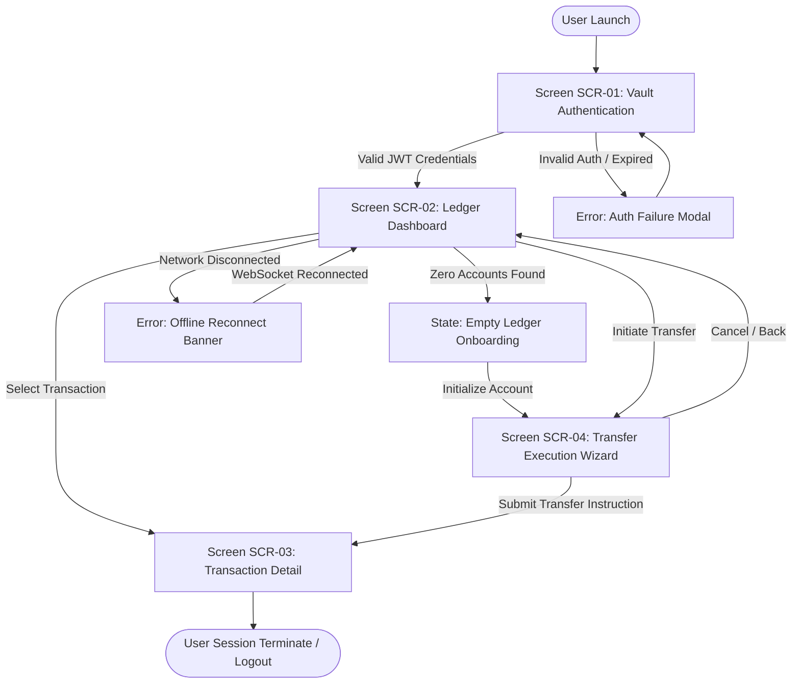

# App Flow Document: QuantumVault Ledger Engine

**Document ID:** FLW-QV-001  
**Version:** 1.0.0  
**Status:** Approved  
**Parent PRD:** PRD-QV-001  
**Target Specification:** SPEC-QUANTUM-VAULT-2026  
**Lead Designer / Architect:** Principal Interaction Architect  
**Last Updated:** 2026-09-07  

---

## 1. Flow Architecture Overview

This document specifies the complete interaction and navigation topology for the QuantumVault treasury console.  
**Gate Rule:** Screens defined herein must map 1:1 to the UI/UX Specification. Zero orphan screens permitted.

---

## 2. Navigable Journey Flowchart (Mermaid)

---

## 3. End-to-End User Journey Walkthroughs

### 3.1 Journey J-01: Treasury Authentication & Balance Inspection
- **Persona:** PERS-01 (Treasury Operator)
- **Entry Point:** Initial URL landing (`/login`)
- **Happy Path Walkthrough:**
  1. Operator lands on `SCR-01` (Vault Authentication) and submits credentials.
  2. System verifies token and redirects operator to `SCR-02` (Ledger Dashboard).
  3. Dashboard establishes live WebSocket stream and populates account cards and transaction ledger.
- **Error & Edge States:**
  - `Auth Failure`: Displays inline invalid credentials message with `aria-live="polite"`.
  - `Network Timeout`: Displays top reconnection banner with exponential retry backoff.
  - `Empty State`: If the organization has zero registered accounts, renders `EMP-01` onboarding prompt.

### 3.2 Journey J-02: Idempotent Transfer Execution & Settlement
- **Persona:** PERS-01 (Treasury Operator)
- **Entry Point:** Click "New Transfer" button on `SCR-02`
- **Happy Path Walkthrough:**
  1. Operator opens `SCR-04` (Transfer Execution Wizard).
  2. Operator enters destination account, currency, amount, and client idempotency reference.
  3. Operator confirms transfer; system posts mutation, commits double-entry journal, and transitions to `SCR-03` (Transaction Detail) with verified receipt.
- **Error & Edge States:**
  - `Duplicate Key Warning`: If reference key was previously executed, notifies operator with "Existing Transaction Retrieved" badge and displays existing record.
  - `Insufficient Liquidity`: Displays inline error and locks submit button.

---

## 4. Screen Inventory Map

| Screen ID | Screen Name | Route / Path | Inbound Navigation | Outbound Navigation | Associated Journeys |
|-----------|-------------|--------------|---------------------|---------------------|---------------------|
| SCR-01 | Vault Authentication | `/login` | Browser Entry / Logout | SCR-02 | J-01 |
| SCR-02 | Ledger Dashboard | `/dashboard` | SCR-01, SCR-03, SCR-04 | SCR-03, SCR-04 | J-01, J-02 |
| SCR-03 | Transaction Detail | `/transactions/:id` | SCR-02, SCR-04 | SCR-02 | J-02 |
| SCR-04 | Transfer Execution Wizard | `/transfers/new` | SCR-02 | SCR-03, SCR-02 | J-02 |

---

## 5. Verification & Consistency Signoff

- [x] Complete navigation paths mapped for all personas
- [x] Explicit error, empty, and offline states specified
- [x] Screen Inventory reconciled with UI/UX Specification (0 orphan screens)
- [x] Approved for Station 06 Exit by Principal Interaction Architect on 2026-09-07
