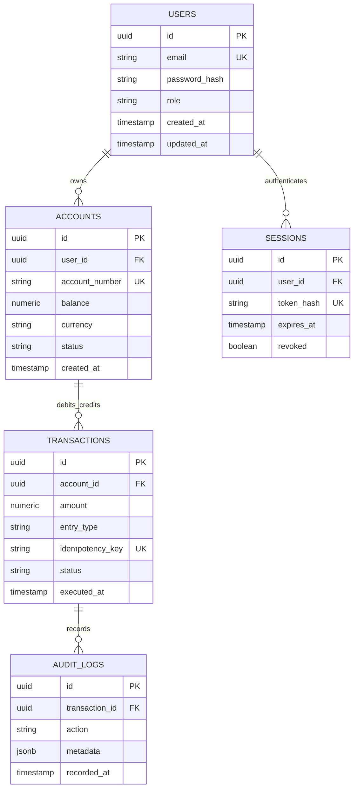

# Schema & Database Design Document: QuantumVault Ledger Engine

**Document ID:** SCH-QV-001  
**Version:** 1.0.0  
**Status:** Synchronized  
**Parent TRD:** TRD-QV-001  
**Target Specification:** SPEC-QUANTUM-VAULT-2026  
**Database Engine:** PostgreSQL 16 (TimescaleDB / Relational)  
**Live Schema Hash:** `sha256:4a8b7f1e9c2d6e3a0b5f8c1d4e7a2b9f6c3e0d5a8b7f1e9c2d6e3a0b5f8c1d4e`  
**Lead Data Architect:** Principal Database Architect  
**Last Updated:** 2026-09-07  

---

## 1. Data Model Architecture Overview

This document specifies the physical relational schema, constraints, indexing strategies, and migration sequence for QuantumVault.  
**Invariants:** All ledger mutations use strict `SERIALIZABLE` isolation with zero uncommitted state drift. Double-entry entries are strictly balanced.

---

## 2. Entity-Relationship Diagram (ERD)

---

## 3. Entity Catalog & Attribute Specifications

### 3.1 Entity: `users`
| Column Name | Type | Nullable | Default | Constraints / Flags | Description |
|-------------|------|----------|---------|---------------------|-------------|
| `id` | `UUID` | No | `gen_random_uuid()` | Primary Key | User unique identifier |
| `email` | `VARCHAR(255)` | No | None | Unique, PII-DIRECT | User institutional email |
| `password_hash`| `VARCHAR(255)` | No | None | SECRET | Argon2id password hash |
| `role` | `VARCHAR(32)` | No | `'operator'` | Check IN ('admin', 'operator', 'auditor') | Access tier |
| `created_at` | `TIMESTAMPTZ` | No | `NOW()` | Audit | Creation timestamp |
| `updated_at` | `TIMESTAMPTZ` | No | `NOW()` | Audit | Modification timestamp |

### 3.2 Entity: `accounts`
| Column Name | Type | Nullable | Default | Constraints / Flags | Description |
|-------------|------|----------|---------|---------------------|-------------|
| `id` | `UUID` | No | `gen_random_uuid()` | Primary Key | Account identifier |
| `user_id` | `UUID` | No | None | Foreign Key -> `users.id` | Owning entity |
| `account_number` | `VARCHAR(64)` | No | None | Unique | External ledger account |
| `balance` | `NUMERIC(18,4)` | No | `0.0000` | Precision check | Current reconciled balance |
| `currency` | `CHAR(3)` | No | `'USD'` | ISO 4217 Currency Code | Denominated currency |
| `status` | `VARCHAR(20)` | No | `'ACTIVE'` | Check IN ('ACTIVE', 'FROZEN') | Operational status |

### 3.3 Entity: `transactions`
| Column Name | Type | Nullable | Default | Constraints / Flags | Description |
|-------------|------|----------|---------|---------------------|-------------|
| `id` | `UUID` | No | `gen_random_uuid()` | Primary Key | Transaction entry ID |
| `account_id` | `UUID` | No | None | Foreign Key -> `accounts.id` | Target account |
| `amount` | `NUMERIC(18,4)` | No | None | Check != 0 | Mutation value |
| `entry_type` | `VARCHAR(10)` | No | None | Check IN ('DEBIT', 'CREDIT') | Double entry line |
| `idempotency_key` | `VARCHAR(128)` | No | None | Unique | Deduplication reference |
| `status` | `VARCHAR(20)` | No | `'COMMITTED'` | Check IN ('PENDING', 'COMMITTED', 'REJECTED') | Settlement state |
| `executed_at` | `TIMESTAMPTZ` | No | `NOW()` | Temporal index | Execution timestamp |

---

## 4. Indexing Strategy & Performance Rationale

| Table Name | Index Name | Columns | Type | Rationale / Query Pattern |
|------------|------------|---------|------|---------------------------|
| `users` | `idx_users_email` | `email` | B-tree Unique | Rapid identity lookup during authentication |
| `accounts` | `idx_accounts_acc_num` | `account_number` | B-tree Unique | O(1) account lookup during transfer validation |
| `transactions`| `idx_tx_acc_exec` | `(account_id, executed_at DESC)` | B-tree Composite | High-performance pagination for dashboard ledger feed |
| `transactions`| `idx_tx_idempotency` | `idempotency_key` | B-tree Unique | Immediate rejection/retrieval of duplicate submissions |
| `audit_logs` | `idx_audit_meta` | `metadata` | GIN | Rapid JSONB filtering for compliance audit queries |

---

## 5. Migration Sequence & Rollback Plan

1. **Migration 001_initial_users.sql**
   - *Apply:* Create `users`, `sessions`, unique constraints, and audit triggers.
   - *Rollback:* `DROP TABLE sessions CASCADE; DROP TABLE users CASCADE;`
2. **Migration 002_create_ledger_tables.sql**
   - *Apply:* Create `accounts`, `transactions`, foreign keys, decimal constraints.
   - *Rollback:* `DROP TABLE transactions CASCADE; DROP TABLE accounts CASCADE;`
3. **Migration 003_audit_and_indexes.sql**
   - *Apply:* Create `audit_logs`, composite indexes, GIN index on metadata.
   - *Rollback:* `DROP INDEX idx_tx_acc_exec; DROP TABLE audit_logs CASCADE;`

---

## 6. Seed & Test Fixture Strategy

- **Test Fixtures:** Standardized seed files in `.factory/specifications/golden-sample/fixtures/seed.json` loaded prior to integration test runs.
- **Transaction Rollback:** All test suites operate in transaction rollback mode ensuring zero database mutation leak.

---

## 7. Data Retention, Privacy & Security (PII & Encryption)

- **PII Masking:** `users.email` and `accounts.account_number` tagged `PII-DIRECT` and redacted in logs.
- **Storage Encryption:** Volume encryption via AES-XTS-plain64 256-bit LUKS key.
- **Retention:** Audit records retained for 7 years immutable per regulatory standards.

---

## 8. Verification & Drift Check Signoff

- [x] ERD regenerated from live schema / migration files
- [x] Schema hash verified against database engine
- [x] All foreign key relationships and composite indexes validated
- [x] Approved by Principal Database Architect on 2026-09-07
