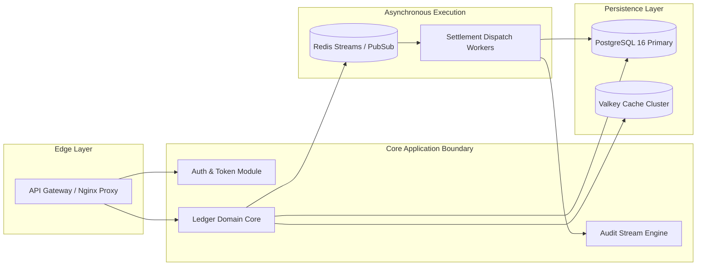

# Backend Architecture Document: QuantumVault Ledger Engine

**Document ID:** ARC-BE-QV-001  
**Version:** 1.0.0  
**Status:** Approved  
**Parent TRD:** TRD-QV-001  
**Target Specification:** SPEC-QUANTUM-VAULT-2026  
**Lead Backend Architect:** Principal Backend Architect  
**Last Updated:** 2026-09-07  

---

## 1. Architectural Narrative & Scope

This document specifies the backend system structure, module boundaries, API surface, caching tiers, asynchronous pipelines, and security perimeters for QuantumVault.  
**Reference:** Narrates the C4 Container and Component models defined in `.factory/architecture/architecture-state.yaml`.

---

## 2. Service & Module Boundaries



### 2.1 Module Boundary Definitions
1. **Auth & Token Module:** Issues and validates cryptographically signed Ed25519 JWT tokens, enforces RBAC policies.
2. **Ledger Domain Core:** Encapsulates transaction validation, idempotency checks, and double-entry serializable mutations.
3. **Audit Stream Engine:** Consumes internal mutation events and persists append-only audit records.

---

## 3. API Surface Summary

| Route Pattern | Method | Protocol | Auth Requirement | Description / Contract |
|---------------|--------|----------|------------------|------------------------|
| `/api/v1/auth/login` | `POST` | REST / JSON | Public (Rate-limited) | Verifies credentials and returns access token |
| `/api/v1/accounts` | `GET` | REST / JSON | Bearer JWT (`operator`) | Retrieves owned accounts and balances |
| `/api/v1/transfers` | `POST` | REST / JSON | Bearer JWT (`operator`) | Executes idempotent fund transfer |
| `/api/v1/transactions/:id`| `GET` | REST / JSON | Bearer JWT (`operator`) | Retrieves transaction receipt and journal lines |
| `/api/v1/stream/ledger`| `GET` | WebSocket | Bearer Query Token | Streams live ledger balance and transaction mutations |

---

## 4. Inter-Service & Component Data Flow

1. **Synchronous Settlement Pipeline:**
   `Client -> Gateway -> JWT Middleware -> Transfer Handler -> Ledger Service (Serializable TX) -> PostgreSQL -> Commit Response`
2. **Asynchronous Streaming Pipeline:**
   `PostgreSQL Commit Hook -> Redis PubSub ('ledger.events') -> WebSocket Gateway -> Connected Client Stream`

---

## 5. Background Jobs, Queues & Task Workers

- **Queue Engine:** Redis Streams (`stream:ledger_settlements`).
- **Worker Concurrency:** 4 worker instances per container, auto-scaled based on queue depth (`depth > 100`).
- **Dead Letter Queue (DLQ):** Failed jobs retry 3 times with exponential backoff (1s, 5s, 25s); unrecoverable failures route to `dlq:dead_letter_stream` with Sentry alert.

---

## 6. Multi-Tier Caching Strategy

- **Tier 1 (In-Memory L1 Cache):** Process memory LRU cache for account metadata and exchange rates (TTL: 60s).
- **Tier 2 (Distributed L2 Cache):** Redis cluster caching read-heavy account balance totals (TTL: 30s) and idempotency keys (TTL: 24 hours).
- **Invalidation Strategy:** Cache-aside with event-driven invalidation on balance mutations.

---

## 7. Third-Party Integrations & Resilience

| External Service | Role | Integration Type | Failure Mode & Circuit Breaker |
|------------------|------|------------------|--------------------------------|
| Identity Provider | OIDC Enterprise SSO | HTTPS / OAuth2 | Fallback to local token verification |
| Telemetry Provider | OpenTelemetry / Sentry | UDP / HTTPS async | Non-blocking async queue; drops on buffer full |

---

## 8. Error Handling & Retry Architecture

- **Standard Error Payload:**
  ```json
  {
    "error": {
      "code": "INSUFFICIENT_FUNDS",
      "message": "Account balance is insufficient for requested transfer.",
      "request_id": "req-qv-8f4b-29c8",
      "timestamp": 1757256000
    }
  }
  ```
- **Circuit Breaker Configuration:** 5 consecutive connection timeouts triggers OPEN state for 30s before HALF-OPEN test probes.

---

## 9. Security Perimeter & Access Controls

- **Authentication:** Ed25519 asymmetric JWT validation with public key cached in memory.
- **Authorization:** Strict role check: `operator` for transfers, `auditor` for read-only audit log queries.
- **Secrets Management:** Loaded via environment variables from HashiCorp Vault; zero plain-text secrets in repository.

---

## 10. Verification & Gate Signoff

- [x] C4 container and component mappings validated
- [x] Error handling and dead-letter queue verified
- [x] Security boundaries and auth flow verified
- [x] Approved by Principal Backend Architect on 2026-09-07
