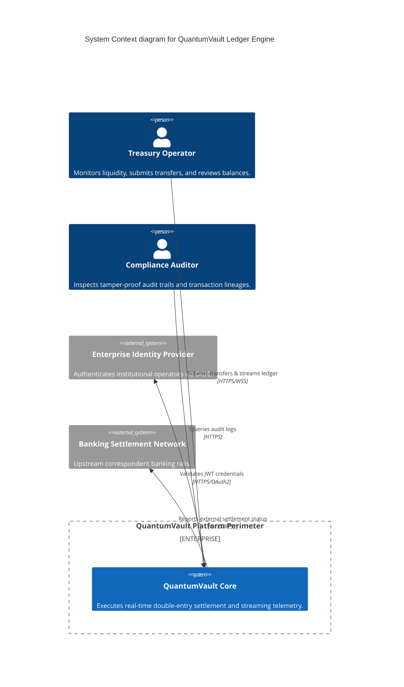
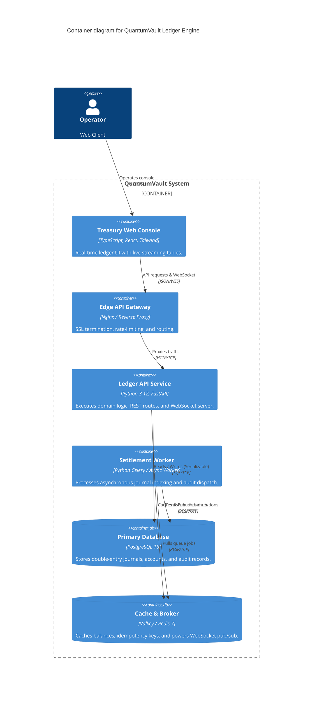
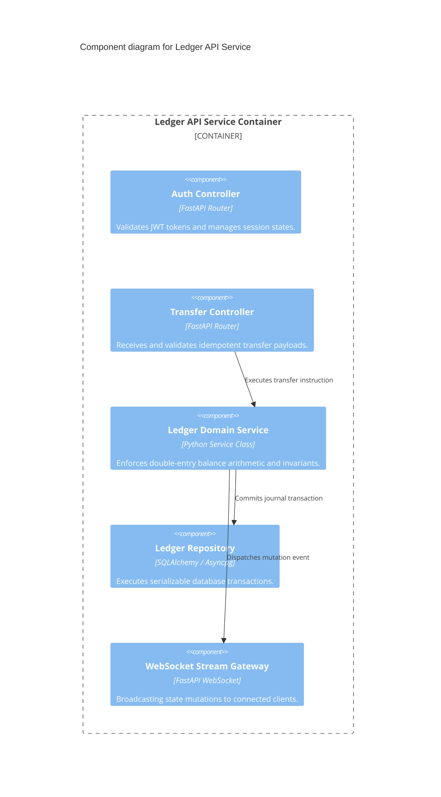

# Full Project Architecture Document: QuantumVault Ledger Engine

**Document ID:** ARC-PROJ-QV-001  
**Version:** 1.0.0  
**Status:** Master Architectural Baseline  
**Parent PRD & TRD:** PRD-QV-001 / TRD-QV-001  
**Target Specification:** SPEC-QUANTUM-VAULT-2026  
**Architecture Model Source:** `.factory/architecture/architecture-state.yaml`  
**Principal Software Architect:** Principal Systems Architect  
**Last Updated:** 2026-09-07  

---

## 1. Executive System Summary

This document unifies the entire architectural specification for the QuantumVault ledger platform, defining its system context, container topology, internal component organization, deployment infrastructure, and disaster recovery procedures.  
**Gate Rule:** This document is the rendered view over `.factory/architecture/architecture-state.yaml`.

---

## 2. C4 Architecture Models

### 2.1 Level 1: System Context (C1)

### 2.2 Level 2: Container Architecture (C2)

### 2.3 Level 3: Component Architecture (C3 - Ledger API Service)

---

## 3. Deployment Topology & Environments

| Environment | Host Infrastructure | Isolation Level | Access Control |
|-------------|---------------------|-----------------|----------------|
| **Development** | Local Docker Compose | Container network | Local developer host |
| **Staging** | Multi-node Kubernetes Staging | Namespace isolated | Tailscale VPN + Staging SSO |
| **Production** | Multi-AZ Kubernetes (AWS EKS) | Private VPC + Subnet Isolation | Zero-Trust Bastion + Mutual TLS |

---

## 4. Trust Boundaries & Security Zones

1. **Zone 1 (Public DMZ):** Cloudflare Edge -> Ingress Gateway (DDoS protection, TLS termination).
2. **Zone 2 (Application Tier):** API Service pods and Worker pods in private subnets with strict egress filtering.
3. **Zone 3 (Data Tier):** Managed PostgreSQL cluster and Redis instances restricted to Zone 2 security group.

---

## 5. Failure Domains, Resiliency & Disaster Recovery

- **Failure Isolation:** Asynchronous worker or cache failure will not block read access to ledger balances.
- **Circuit Breaking:** External network timeouts trip circuit breakers to prevent connection pool starvation.
- **RTO (Recovery Time Objective):** < 15 minutes via automated pod restart and read-replica promotion.
- **RPO (Recovery Point Objective):** < 5 minutes via continuous WAL streaming to cloud object storage.

---

## 6. Architecture State Synchronization & Verification

- [x] System Context, Containers, and Components match `.factory/architecture/architecture-state.yaml`
- [x] Trust boundaries and deployment topologies documented
- [x] Disaster recovery parameters (RTO/RPO) defined
- [x] Approved by Principal Systems Architect on 2026-09-07
