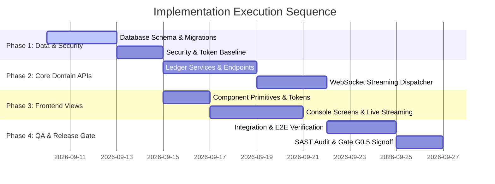

# Implementation Plan: QuantumVault Ledger Engine

**Document ID:** PLN-QV-001  
**Version:** 1.0.0  
**Status:** Ready for Execution  
**Parent PRD:** PRD-QV-001  
**Parent TRD:** TRD-QV-001  
**Parent Architecture:** ARC-PROJ-QV-001  
**Target Specification:** SPEC-QUANTUM-VAULT-2026  
**Delivery Lead:** Technical Delivery Manager  
**Last Updated:** 2026-09-07  

---

## 1. Plan Synthesis & Input Verification

This Implementation Plan compiles requirements, architectural contracts, user flows, and testing strategies into an executable, dependency-ordered work package hierarchy.

### 1.1 Input Document Verification Gate
- [x] PRD-QV-001 (Functional & Non-Functional requirements locked)
- [x] TRD-QV-001 (Technical interfaces & constraints verified)
- [x] FLW-QV-001 (App flows & screen journeys mapped)
- [x] UIX-QV-001 (UI/UX design specs & tokens finalized)
- [x] SCH-QV-001 (Schema models & migrations verified)
- [x] ARC-PROJ-QV-001 (C1-C3 architecture ratified)
- [x] TST-QV-001 (Testing strategy & acceptance criteria matrix linked)

---

## 2. Work Breakdown Structure & Phases

---

## 3. Ordered Task Specifications & Dependency DAG

### Task TSK-001: Implement Database Schemas & Migrations
- **Station:** Station 04 (Data Architecture)
- **Assigned Agent:** Database Architect
- **Traceability:** [FR-001], [TRD-DAT-01], [SCH-QV-001]
- **Dependencies:** None (Root Task)
- **Required Skills:** `database-postgresql`, `schema-design-document`
- **Required MCP Servers:** `postgres`, `factory-memory-mcp`
- **Required Raw Materials:** PostgreSQL migration scaffold, Docker Compose DB definition
- **Complexity / Risk:** Medium Complexity / High Risk (Data foundation)
- **Acceptance Criteria:**
  1. SQL migrations execute cleanly forward and backward.
  2. Tables, foreign keys, and unique indexes match `SCH-QV-001`.
- **Rollback Procedure:** Execute down-migration SQL script; restore database snapshot.

### Task TSK-002: Implement Ledger Services & REST/WebSocket APIs
- **Station:** Station 08 (Backend Engineering)
- **Assigned Agent:** Backend Engineer
- **Traceability:** [FR-001], [FR-002], [FR-003], [TRD-API-01], [ARC-BE-QV-001]
- **Dependencies:** `TSK-001`
- **Required Skills:** `backend-fastapi`, `fastapi-patterns`, `api-design`
- **Required MCP Servers:** `factory-context-mcp`
- **Required Raw Materials:** FastAPI enterprise scaffold
- **Complexity / Risk:** High Complexity / Medium Risk
- **Acceptance Criteria:**
  1. Transfer endpoint enforces idempotency and serializable transactions.
  2. WebSocket endpoint broadcasts ledger mutation events to subscribers within 150ms.
- **Rollback Procedure:** Disable feature flag; revert service container image to prior release.

### Task TSK-003: Implement Treasury Console Frontend Views
- **Station:** Station 09 (Frontend Engineering)
- **Assigned Agent:** Frontend Engineer
- **Traceability:** [FLW-QV-001], [UIX-QV-001]
- **Dependencies:** `TSK-002`
- **Required Skills:** `frontend-react`, `uiux-specification`, `accessibility`
- **Required MCP Servers:** `playwright`
- **Required Raw Materials:** Tailwind theme configuration, UI primitives
- **Complexity / Risk:** Medium Complexity / Low Risk
- **Acceptance Criteria:**
  1. Screens SCR-01 through SCR-04 render all 5 states according to specification.
  2. Real-time balance streaming operates without UI flickering or console errors.
- **Rollback Procedure:** Revert static assets bundle release in CDN.

### Task TSK-004: Execute Full Multi-Layer Test Suite & Gate Signoff
- **Station:** Station 12 (QA & Release Control)
- **Assigned Agent:** QA Lead
- **Traceability:** [TST-QV-001], [NFR-001], [NFR-003], [NFR-005]
- **Dependencies:** `TSK-002`, `TSK-003`
- **Required Skills:** `testing-e2e`, `security-review`, `performance-engineering`
- **Required MCP Servers:** `playwright`, `factory-context-mcp`
- **Required Raw Materials:** Testcontainers, axe-core
- **Complexity / Risk:** High Complexity / High Risk
- **Acceptance Criteria:**
  1. 100% of PRD acceptance criteria verified by automated test cases.
  2. Zero High/Critical security vulnerabilities from SAST scan.
  3. Quality Gates G0.5 and G7-G13 pass cleanly.
- **Rollback Procedure:** Block release candidate signoff and prevent production promotion.

---

## 4. Execution Readiness Signoff

- [x] All work packages mapped with clear agent assignments
- [x] Dependencies form an acyclic directed graph (DAG)
- [x] Rollback procedures defined for every phase
- [x] Approved for Manufacturing Assembly Entry by Technical Delivery Manager on 2026-09-07
