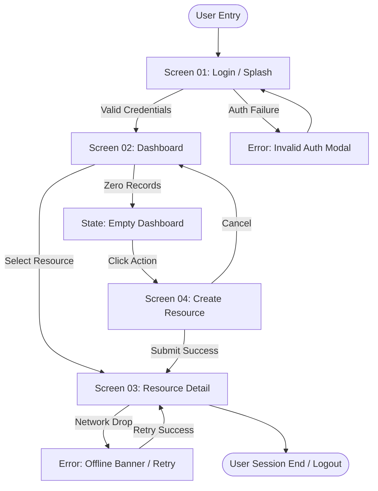

# App Flow Document: {{PRODUCT_TITLE}}

**Document ID:** FLW-{{PROJECT_ID}}-001  
**Version:** {{VERSION}}  
**Status:** {{STATUS}} (Draft | Approved | Locked)  
**Parent PRD:** PRD-{{PROJECT_ID}}-001  
**Target Specification:** {{TARGET_SPEC_ID}}  
**Lead Designer / Architect:** {{LEAD_DESIGNER}}  
**Last Updated:** {{DATE}}  

---

## 1. Flow Architecture Overview

This document maps all primary and secondary user journeys end-to-end through {{PRODUCT_TITLE}}.  
**Gate Rule:** Every screen defined in this document must appear in the UI/UX Specification, and every screen in the UI/UX Specification must appear in this flow map. Zero orphan screens permitted.

---

## 2. Navigable Journey Flowchart (Mermaid)

---

## 3. End-to-End User Journey Walkthroughs

### 3.1 Journey J-01: {{JOURNEY_01_NAME}}
- **Persona:** {{PERSONA_ID}}
- **Entry Point:** {{ENTRY_POINT}}
- **Happy Path Walkthrough:**
  1. User lands on `{{SCREEN_01_ID}}` ({{SCREEN_01_NAME}}).
  2. User inputs credentials and clicks submit.
  3. System transitions to `{{SCREEN_02_ID}}` ({{SCREEN_02_NAME}}).
- **Decision Branches:**
  - Branch 1 (Success): Transitions to main workspace.
  - Branch 2 (MFA Challenge): Transitions to MFA challenge screen before workspace.
- **Error & Edge States:**
  - `Auth Failure`: Displays inline credential error. Does not navigate away.
  - `Network Timeout`: Displays retry button with cached token retry logic.
  - `Empty State`: If user has zero active items, renders welcome onboarding widget with CTA button.

### 3.2 Journey J-02: {{JOURNEY_02_NAME}}
- **Persona:** {{PERSONA_ID}}
- **Entry Point:** {{ENTRY_POINT}}
- **Happy Path Walkthrough:**
  1. User triggers primary action on `{{SCREEN_02_ID}}`.
  2. User reviews and confirms details in `{{SCREEN_03_ID}}`.
  3. Action executes and user receives confirmation.
- **Error & Edge States:**
  - `Validation Error`: Field-level error messages highlighted.
  - `Rate Limit Exceeded`: Toast alert with countdown backoff.

---

## 4. Screen Inventory Map

*Every screen referenced across design artifacts MUST appear in this inventory.*

| Screen ID | Screen Name | Route / Path | Inbound Navigation | Outbound Navigation | Associated Journeys |
|-----------|-------------|--------------|---------------------|---------------------|---------------------|
| SCR-01 | Login Screen | `/login` | Entry / Logout | SCR-02, SCR-MFA | J-01 |
| SCR-02 | Main Dashboard | `/dashboard` | SCR-01, SCR-03 | SCR-03, SCR-04 | J-01, J-02 |
| SCR-03 | Resource Detail | `/resources/:id` | SCR-02, SCR-04 | SCR-02 | J-02 |
| SCR-04 | Resource Creator | `/resources/new` | SCR-02 | SCR-03, SCR-02 | J-02 |

---

## 5. Verification & Consistency Signoff

- [ ] Complete navigation paths mapped for all personas
- [ ] Explicit error, empty, and offline states specified
- [ ] Screen Inventory reconciled with UI/UX Specification (0 orphan screens)
- [ ] Approved for Station 06 Exit: {{APPROVER}} on {{SIGNOFF_DATE}}
