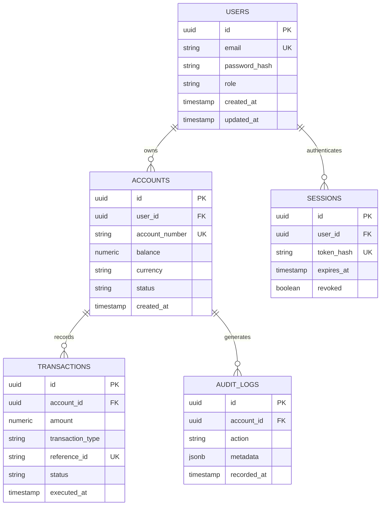

# Schema & Database Design Document: {{PRODUCT_TITLE}}

**Document ID:** SCH-{{PROJECT_ID}}-001  
**Version:** {{VERSION}}  
**Status:** {{STATUS}} (Draft | Verified | Synchronized)  
**Parent TRD:** TRD-{{PROJECT_ID}}-001  
**Target Specification:** {{TARGET_SPEC_ID}}  
**Database Engine:** {{DATABASE_ENGINE}} (e.g. PostgreSQL 16 / TimescaleDB)  
**Live Schema Hash:** `sha256:{{LIVE_SCHEMA_HASH}}`  
**Lead Data Architect:** {{DATA_ARCHITECT}}  
**Last Updated:** {{DATE}}  

---

## 1. Data Model Architecture Overview

This document specifies the logical and physical data schemas for {{PRODUCT_TITLE}}.  
**Gate Rule:** This document must be regenerable and diffed against the active database migration files and live catalog before being marked `VERIFIED`.

---

## 2. Entity-Relationship Diagram (ERD)

---

## 3. Entity Catalog & Attribute Specifications

### 3.1 Entity: `users`
- **Description:** System identity and authentication root.
- **Attributes:**
  | Column Name | Type | Nullable | Default | Constraints / Flags | Description |
  |-------------|------|----------|---------|---------------------|-------------|
  | `id` | `UUID` | No | `gen_random_uuid()` | Primary Key | Unique user identity |
  | `email` | `VARCHAR(255)` | No | None | Unique, PII Flag | Normalized user email |
  | `password_hash` | `VARCHAR(255)` | No | None | Sensitive Flag | Argon2id password hash |
  | `role` | `VARCHAR(32)` | No | `'member'` | Check IN ('admin', 'member') | Authorization level |
  | `created_at` | `TIMESTAMPTZ` | No | `NOW()` | Audit | Record creation time |
  | `updated_at` | `TIMESTAMPTZ` | No | `NOW()` | Audit | Record modification time |

### 3.2 Entity: `accounts`
- **Description:** Financial or operational account ledger entity.
- **Attributes:**
  | Column Name | Type | Nullable | Default | Constraints / Flags | Description |
  |-------------|------|----------|---------|---------------------|-------------|
  | `id` | `UUID` | No | `gen_random_uuid()` | Primary Key | Account identity |
  | `user_id` | `UUID` | No | None | Foreign Key -> `users.id` | Owning user |
  | `account_number` | `VARCHAR(64)` | No | None | Unique | External reference |
  | `balance` | `NUMERIC(18,4)` | No | `0.0000` | Positive constraint | Accurate balance |
  | `currency` | `CHAR(3)` | No | `'USD'` | ISO currency code | Denominated currency |
  | `status` | `VARCHAR(20)` | No | `'ACTIVE'` | Check IN ('ACTIVE', 'FROZEN') | State |

---

## 4. Indexing Strategy & Performance Rationale

| Table Name | Index Name | Columns | Type | Rationale / Query Pattern |
|------------|------------|---------|------|---------------------------|
| `users` | `idx_users_email` | `email` | B-tree (Unique) | Rapid user lookup during authentication |
| `accounts` | `idx_accounts_user_id` | `user_id` | B-tree | Fast foreign key joins from user context |
| `transactions`| `idx_tx_acc_time` | `(account_id, executed_at DESC)` | B-tree Composite | High-frequency ledger history pagination |
| `audit_logs` | `idx_audit_meta_gin` | `metadata` | GIN | Fast arbitrary JSONB key-value search |

---

## 5. Migration Sequence & Rollback Plan

1. **Migration 001_initial_users.sql**
   - *Apply:* Creates `users` table, unique index, and timestamp triggers.
   - *Rollback:* `DROP TABLE users CASCADE;`
2. **Migration 002_create_accounts_and_tx.sql**
   - *Apply:* Creates `accounts`, `transactions`, foreign keys, and decimal precision checks.
   - *Rollback:* `DROP TABLE transactions CASCADE; DROP TABLE accounts CASCADE;`
3. **Migration 003_audit_and_indexes.sql**
   - *Apply:* Adds composite index `idx_tx_acc_time` and `audit_logs` GIN indexing.
   - *Rollback:* `DROP INDEX idx_tx_acc_time; DROP TABLE audit_logs CASCADE;`

---

## 6. Seed & Test Fixture Strategy

- **Development Seed:** 5 mock personas, 10 test accounts with deterministic balances, pre-generated JWT test sessions.
- **Fixture Idempotency:** Managed via SQL transaction rollback during test teardown.

---

## 7. Data Retention, Privacy & Security (PII & Encryption)

- **PII Tagging:**
  - `users.email`: Tagged `PII-DIRECT`. Masked in all logs (`u***@domain.com`).
  - `users.password_hash`: Tagged `SECRET`. Excluded from API serialization models.
- **Encryption at Rest:** Storage volumes encrypted with AES-256 via LUKS / cloud KMS.
- **Retention Policy:** Audit records retained for 7 years per regulatory compliance; inactive sessions purged after 30 days.

---

## 8. Verification & Drift Check Signoff

- [ ] ERD regenerated from live schema / migration files
- [ ] Schema hash verified against database engine
- [ ] All foreign key relationships and composite indexes validated
- [ ] Approved by Data Architect: {{APPROVER}} on {{SIGNOFF_DATE}}
