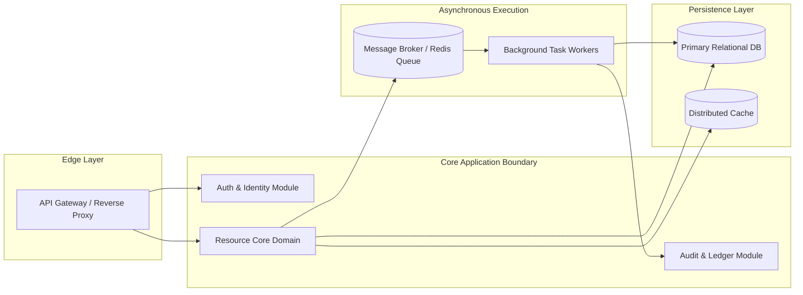

# Backend Architecture Document: {{PRODUCT_TITLE}}

**Document ID:** ARC-BE-{{PROJECT_ID}}-001  
**Version:** {{VERSION}}  
**Status:** {{STATUS}} (Draft | Approved | Architectural Baseline)  
**Parent TRD:** TRD-{{PROJECT_ID}}-001  
**Target Specification:** {{TARGET_SPEC_ID}}  
**Lead Backend Architect:** {{BACKEND_ARCHITECT}}  
**Last Updated:** {{DATE}}  

---

## 1. Architectural Narrative & Scope

This document specifies the backend system structure, module boundaries, data pipelines, caching tiers, asynchronous processing, and security perimeters for {{PRODUCT_TITLE}}.  
**Reference:** Narrates the C4 Container and Component definitions registered in `architecture-state.yaml`.

---

## 2. Service & Module Boundaries



### 2.1 Module Boundary Definitions
1. **Auth & Identity Module:** Issues and validates cryptographically signed JWT tokens, enforces RBAC policies.
2. **Resource Core Domain:** Encapsulates domain logic, invariants, idempotency validation, and primary state transitions.
3. **Audit & Ledger Module:** Implements append-only audit event recording with immutable hash-chaining.

---

## 3. API Surface Summary

| Route Pattern | Method | Protocol | Auth Requirement | Description / Contract |
|---------------|--------|----------|------------------|------------------------|
| `/api/v1/auth/token` | `POST` | REST / JSON | Public (Rate-limited) | Issues access and refresh tokens |
| `/api/v1/resources` | `GET` | REST / JSON | Bearer JWT (`read`) | Paginated list of resources |
| `/api/v1/resources` | `POST` | REST / JSON | Bearer JWT (`write`) | Creates resource with idempotency check |
| `/api/v1/resources/:id`| `GET` | REST / JSON | Bearer JWT (`read`) | Detail view with cached telemetry |
| `/api/v1/stream/events`| `GET` | WebSocket | Bearer Query Token | Real-time state change notifications |

---

## 4. Inter-Service & Component Data Flow

1. **Synchronous Request Pipeline:**
   `Client -> TLS Gateway -> Rate Limiter -> JWT Middleware -> Route Handler -> Domain Service -> Data Layer -> Response`
2. **Asynchronous Processing Pipeline:**
   `Route Handler -> Broker.Publish(event) -> Worker Pool -> Process Job -> DB Mutation -> WebSocket Broadcast`

---

## 5. Background Jobs, Queues & Task Workers

- **Queue Engine:** Redis Streams / Celery / BullMQ.
- **Worker Concurrency:** 4 worker instances per container, autoscaled based on queue depth (`depth > 100`).
- **Dead Letter Queue (DLQ):** Failed jobs retry 3 times with exponential backoff (1s, 5s, 25s); unrecoverable failures route to `dlq:dead_letter_stream` with Sentry alert.

---

## 6. Multi-Tier Caching Strategy

- **Tier 1 (In-Memory L1 Cache):** Process memory LRU cache for configuration and schema metadata (TTL: 300s).
- **Tier 2 (Distributed L2 Cache):** Redis cluster caching read-heavy endpoints and user session tokens (TTL: 60s - 3600s).
- **Invalidation Strategy:** Cache-aside with event-driven invalidation on state mutations (e.g. `POST /api/v1/resources` invalidates `cache:resources:list:*`).

---

## 7. Third-Party Integrations & Resilience

| External Service | Role | Integration Type | Failure Mode & Circuit Breaker |
|------------------|------|------------------|--------------------------------|
| Identity Provider / SSO | User Authentication | OpenID Connect | Fallback to local credential auth |
| Telemetry / Observability | Metrics & Tracing | OpenTelemetry / Sentry | Non-blocking async queue; drops on buffer full |

---

## 8. Error Handling & Retry Architecture

- **Standard Error Payload:**
  ```json
  {
    "error": {
      "code": "RESOURCE_CONFLICT",
      "message": "A resource with this key already exists.",
      "request_id": "req-8f4b-29c8",
      "timestamp": 1757256000
    }
  }
  ```
- **Circuit Breaker Configuration:** 5 consecutive failures triggers OPEN state for 30s before HALF-OPEN test probes.

---

## 9. Security Perimeter & Access Controls

- **Authentication:** Asymmetric RSA256 or Ed25519 JWT verification; public keys rotated every 90 days.
- **Authorization:** Role-Based Access Control (`role:admin`, `role:member`) enforced at middleware and service layers.
- **Secrets Management:** Environment variables populated from secure secret vault; zero secrets stored in source code.

---

## 10. Verification & Gate Signoff

- [ ] C4 container and component mappings validated
- [ ] Error handling and dead-letter queue verified
- [ ] Security boundaries and auth flow verified
- [ ] Approved by Backend Architect: {{APPROVER}} on {{SIGNOFF_DATE}}
