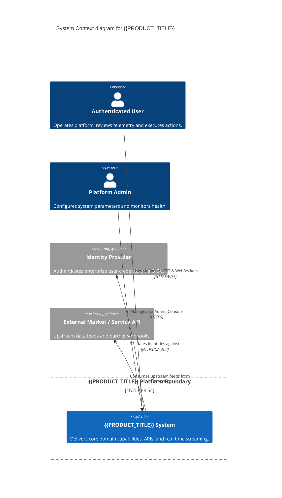
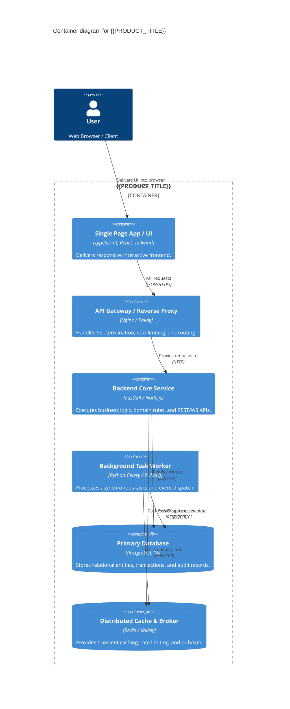
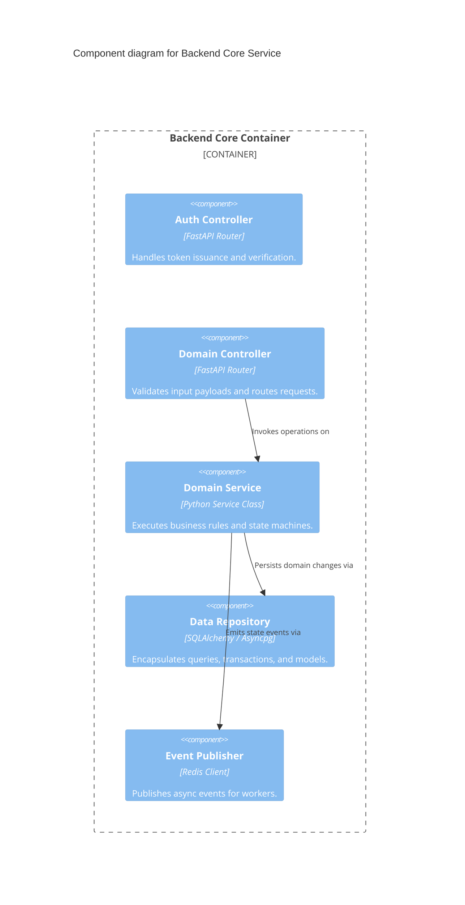

# Full Project Architecture Document: {{PRODUCT_TITLE}}

**Document ID:** ARC-PROJ-{{PROJECT_ID}}-001  
**Version:** {{VERSION}}  
**Status:** {{STATUS}} (Draft | Approved | Master Architectural Baseline)  
**Parent PRD & TRD:** PRD-{{PROJECT_ID}}-001 / TRD-{{PROJECT_ID}}-001  
**Target Specification:** {{TARGET_SPEC_ID}}  
**Architecture Model Source:** `.factory/architecture/architecture-state.yaml`  
**Principal Software Architect:** {{PRINCIPAL_ARCHITECT}}  
**Last Updated:** {{DATE}}  

---

## 1. Executive System Summary

This document serves as the master architectural blueprint for {{PRODUCT_TITLE}}, unifying the system context, container distribution, internal component breakdown, operational topology, security trust boundaries, and disaster recovery strategies.  
**Gate Rule:** This document is a rendered view over `.factory/architecture/architecture-state.yaml`. Any discrepancy between this document and `architecture-state.yaml` represents architectural drift and fails Quality Gate 0.5.

---

## 2. C4 Architecture Models

### 2.1 Level 1: System Context (C1)
Describes how users and external enterprise systems interact with {{PRODUCT_TITLE}}.

### 2.2 Level 2: Container Architecture (C2)
Illustrates high-level execution units, web clients, API backend services, data stores, and message buses.

### 2.3 Level 3: Component Architecture (C3 - Backend Core)

---

## 3. Deployment Topology & Environments

| Environment | Host Infrastructure | Isolation Level | Access Control |
|-------------|---------------------|-----------------|----------------|
| **Development** | Local Docker Compose | Container network | Developer workstations |
| **Staging** | Kubernetes Staging Cluster | Namespace isolated | VPN + Staging SSO |
| **Production** | Multi-AZ Kubernetes (AWS EKS / Bare-Metal) | Full VPC Isolation | Strict Zero-Trust Bastion + Mutual TLS |

---

## 4. Trust Boundaries & Security Zones

1. **Zone 1 (Public DMZ):** Cloudflare / CDN and Edge Ingress. SSL termination and DDoS mitigation.
2. **Zone 2 (Internal Application Tier):** API Gateway, Backend API pods, Background Worker pods. Mutual TLS authentication.
3. **Zone 3 (Protected Data Tier):** PostgreSQL cluster with read replicas and Redis in private subnets with strict security groups.

---

## 5. Failure Domains, Resiliency & Disaster Recovery

- **Failure Isolation:** Any individual worker failure does not impact synchronous API serving.
- **Circuit Breaking:** External integration failures degrade gracefully without cascading container crashes.
- **RTO (Recovery Time Objective):** < 15 minutes. Automated pod rescheduling and DB failover.
- **RPO (Recovery Point Objective):** < 5 minutes. Continuous WAL streaming and hourly database snapshots.

---

## 6. Architecture State Synchronization & Verification

- [ ] System Context, Containers, and Components match `.factory/architecture/architecture-state.yaml`
- [ ] Trust boundaries and deployment topologies documented
- [ ] Disaster recovery parameters (RTO/RPO) defined
- [ ] Approved by Principal Architect: {{APPROVER}} on {{SIGNOFF_DATE}}
