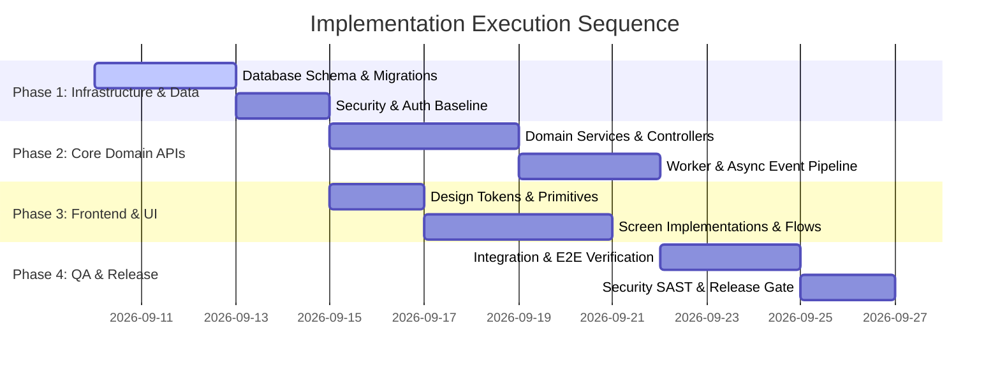

# Implementation Plan: {{PRODUCT_TITLE}}

**Document ID:** PLN-{{PROJECT_ID}}-001  
**Version:** {{VERSION}}  
**Status:** {{STATUS}} (Draft | Ready for Execution | In Progress)  
**Parent PRD:** PRD-{{PROJECT_ID}}-001  
**Parent TRD:** TRD-{{PROJECT_ID}}-001  
**Parent Architecture:** ARC-PROJ-{{PROJECT_ID}}-001  
**Target Specification:** {{TARGET_SPEC_ID}}  
**Delivery Lead:** {{DELIVERY_LEAD}}  
**Last Updated:** {{DATE}}  

---

## 1. Plan Synthesis & Input Verification

This Implementation Plan compiles requirements, architectural contracts, user flows, and testing strategies into an executable, dependency-ordered work package hierarchy.

### 1.1 Input Document Verification Gate
- [x] PRD-{{PROJECT_ID}}-001 (Functional & Non-Functional requirements locked)
- [x] TRD-{{PROJECT_ID}}-001 (Technical interfaces & constraints verified)
- [x] FLW-{{PROJECT_ID}}-001 (App flows & screen journeys mapped)
- [x] UIX-{{PROJECT_ID}}-001 (UI/UX design specs & tokens finalized)
- [x] SCH-{{PROJECT_ID}}-001 (Schema models & migrations verified)
- [x] ARC-PROJ-{{PROJECT_ID}}-001 (C1-C3 architecture ratified)
- [x] TST-{{PROJECT_ID}}-001 (Testing strategy & acceptance criteria matrix linked)

---

## 2. Work Breakdown Structure & Phases

---

## 3. Ordered Task Specifications & Dependency DAG

### Task TSK-001: Database Schema & Migration Setup
- **Station:** Station 04 (Data Architecture)
- **Assigned Agent:** Database Architect
- **Traceability:** [FR-001], [TRD-DAT-01], [SCH-{{PROJECT_ID}}-001]
- **Dependencies:** None (Root Task)
- **Required Skills:** `database-postgresql`, `schema-design-document`
- **Required MCP Servers:** `postgres`, `factory-memory-mcp`
- **Required Raw Materials:** PostgreSQL migration scaffold, Docker Compose DB definition
- **Complexity / Risk:** Medium Complexity / High Risk (Data foundation)
- **Acceptance Criteria:**
  1. SQL migration scripts execute cleanly up and down.
  2. Tables and indexes match `SCH-{{PROJECT_ID}}-001` specification.
- **Rollback Consideration:** Execute down-migration scripts; revert git migration files.

### Task TSK-002: Core Backend API & Business Logic
- **Station:** Station 08 (Backend Engineering)
- **Assigned Agent:** Backend Engineer
- **Traceability:** [FR-001], [FR-002], [TRD-API-01], [ARC-BE-{{PROJECT_ID}}-001]
- **Dependencies:** `TSK-001`
- **Required Skills:** `backend-fastapi`, `fastapi-patterns`, `api-design`
- **Required MCP Servers:** `factory-context-mcp`
- **Required Raw Materials:** FastAPI service template
- **Complexity / Risk:** High Complexity / Medium Risk
- **Acceptance Criteria:**
  1. REST and WebSocket endpoints implement specified schemas.
  2. 100% of unit tests pass for domain business logic.
- **Rollback Consideration:** Feature flag disable; service rollback to previous stable image.

### Task TSK-003: UI Components & Screen Implementation
- **Station:** Station 09 (Frontend Engineering)
- **Assigned Agent:** Frontend Engineer
- **Traceability:** [FLW-{{PROJECT_ID}}-001], [UIX-{{PROJECT_ID}}-001]
- **Dependencies:** `TSK-002`
- **Required Skills:** `frontend-react`, `ui-ux-premium`, `accessibility`
- **Required MCP Servers:** `playwright`
- **Required Raw Materials:** Tailwind theme configuration, UI component primitives
- **Complexity / Risk:** Medium Complexity / Low Risk
- **Acceptance Criteria:**
  1. Screens render with specified design tokens across mobile and desktop.
  2. All 5 states (default, loading, empty, error, success) verified.
- **Rollback Consideration:** Revert frontend bundle release.

### Task TSK-004: Comprehensive Test Suite & Quality Gate Signoff
- **Station:** Station 12 (QA & Release Control)
- **Assigned Agent:** QA Engineer
- **Traceability:** [TST-{{PROJECT_ID}}-001], [NFR-001], [NFR-003]
- **Dependencies:** `TSK-002`, `TSK-003`
- **Required Skills:** `testing-e2e`, `security-review`, `performance-engineering`
- **Required MCP Servers:** `playwright`, `factory-context-mcp`
- **Complexity / Risk:** Medium Complexity / Medium Risk
- **Acceptance Criteria:**
  1. All acceptance criteria from PRD verified by automated tests.
  2. Quality Gate G0.5, G7, G8, G9 passing 100%.
- **Rollback Consideration:** Block release candidate signoff.

---

## 4. Execution Readiness Signoff

- [ ] All work packages mapped with clear agent assignments
- [ ] Dependencies form an acyclic directed graph (DAG)
- [ ] Rollback procedures defined for every phase
- [ ] Approved for Manufacturing Assembly Entry: {{APPROVER}} on {{SIGNOFF_DATE}}
