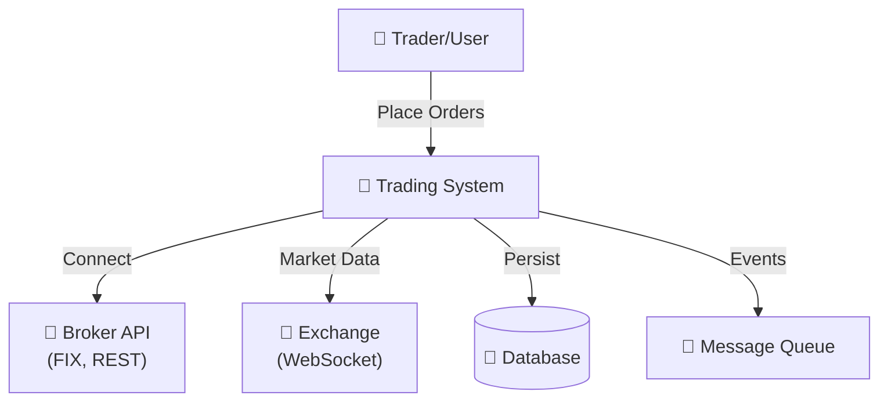
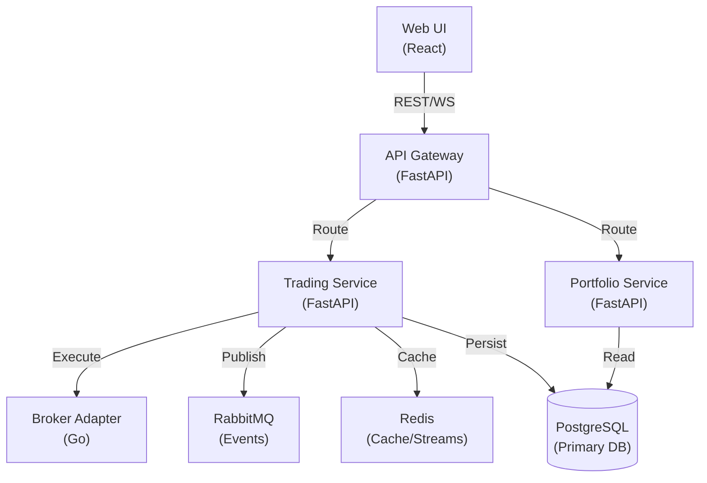
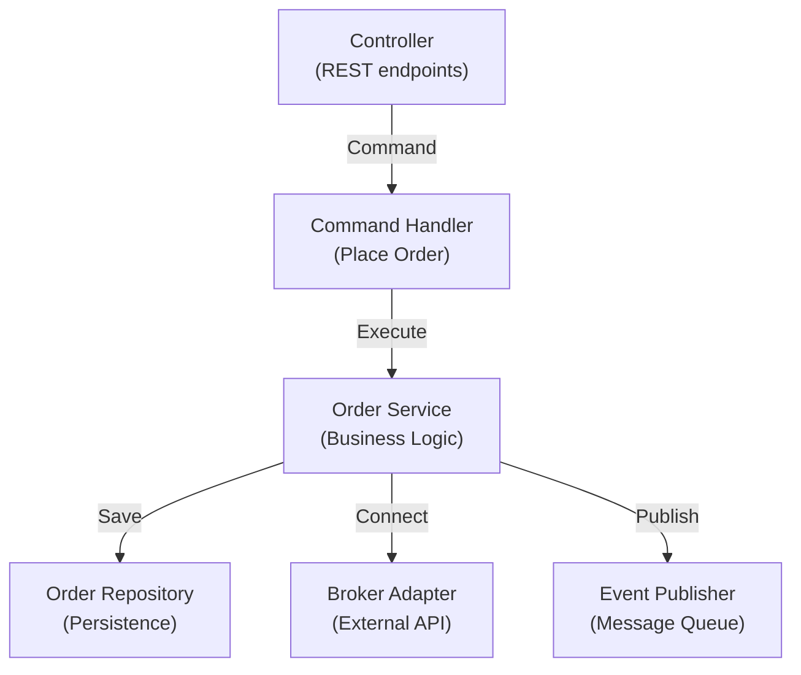
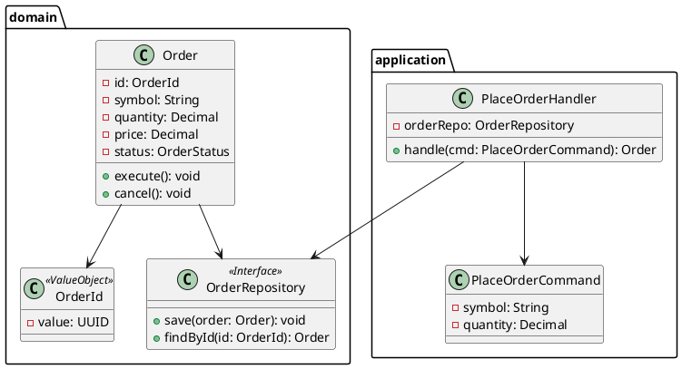
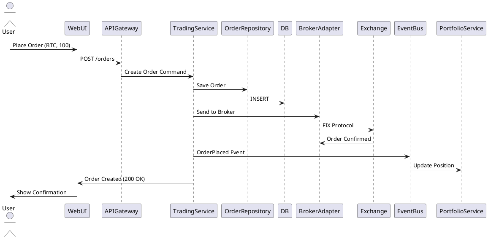

# Architecture Discovery & Living Documentation System

**Version:** 1.0  
**Status:** Autonomous Living Artifact  
**Owner:** Principal Software Architect (Claude, Copilot, Gemini, Cursor, etc.)

---

## Mission

Transform any repository into a **comprehensive, living architectural map** that evolves with code changes. Enable any AI agent to understand system design from business context down to individual classes.

---

## Core Phases (Executable by Any Agent)

### PHASE 1 — Repository Scan & Tree Generation

**Trigger:** User asks for architecture map, project structure, or code understanding  
**Execute:** Generate annotated directory tree

```bash
# Scan entire repository
find . -type f -name "*.{py,ts,js,go,java,rs,cpp}" | head -500
find . -type d -name ".git" -prune -o -type d -print | sort

# Identify key files
ls -la | grep -E "(Dockerfile|docker-compose|kubernetes|terraform|.github)"
```

**Output:** `docs/architecture/REPOSITORY_MAP.md`

Format:
```markdown
# Repository Structure

project-root/
├── .github/                       # CI/CD automation
│   ├── workflows/ci.yml           # Build pipeline (GHA)
│   └── CODEOWNERS                 # Code review owners
├── docs/                          # Living documentation
│   ├── architecture/              # Architecture artifacts
│   ├── diagrams/c4/               # C4 Model diagrams
│   └── ARCHITECTURE.md            # Master architecture doc
├── src/                           # Source code (C4 Component level)
│   ├── api-gateway/               # Container: API Gateway
│   ├── auth-service/              # Container: Auth
│   └── core-domain/               # Container: Business Logic
│       ├── domain/                # DDD: Enterprise/Business Logic
│       ├── application/           # DDD: Use Cases
│       ├── infrastructure/        # DDD: Adapters
│       └── presentation/          # DDD: Controllers
├── tests/                         # Testing
│   ├── unit/                      # Domain layer tests
│   ├── integration/               # Component tests
│   └── e2e/                       # Full system tests
├── deployments/                   # Infrastructure as Code
│   ├── docker/                    # Container definitions
│   ├── kubernetes/                # K8s manifests
│   └── terraform/                 # Cloud resources
└── README.md                      # Onboarding guide
```

---

### PHASE 2 — Architecture Pattern Detection

**Trigger:** After tree generation  
**Detect:** Architecture style, patterns, paradigms

**Patterns to Identify:**
- **Monolith** vs **Modular Monolith** vs **Microservices**
- **DDD** (Bounded Contexts, Aggregates)
- **Hexagonal** / **Onion** / **Clean** Architecture
- **CQRS** / **Event Sourcing**
- **Layered** vs **Vertical Slice**
- **Event-Driven**
- **Serverless**

**Analysis Method:**
1. Count services/packages
2. Look for bounded context markers (separate domains, services)
3. Detect presentation/application/domain/infrastructure separation
4. Find CQRS (separate read/write models)
5. Find event handlers, event stores, sagas
6. Check for external integrations

**Output:** `docs/architecture/ARCHITECTURE_ANALYSIS.md`

```markdown
# Architecture Analysis

## Detection Results

| Style | Confidence | Evidence |
|-------|-----------|----------|
| Microservices | 92% | 7 autonomous services, separate DBs, async messaging |
| DDD | 88% | Bounded contexts in /domain, aggregates, value-objects |
| CQRS | 74% | Separate read/write paths in application/ |
| Event-Driven | 68% | Event handlers, Kafka integration |

## Primary Patterns
- **Microservices + DDD** (92% confidence)
- Supporting patterns: **CQRS, Event Sourcing**
```

---

### PHASE 3 — Domain-Driven Design Analysis

**Detect:** Bounded Contexts, Aggregates, Entities, Value Objects, Repositories

**Method:**
1. Scan for `/domain`, `/entities`, `/aggregates`, `/value-objects` folders
2. Find repository interfaces (pattern: `I*Repository`, `*Repository`)
3. Identify services (pattern: `*Service`, `*UseCase`, `*CommandHandler`)
4. Detect commands, queries, events (CQRS)

**Output:** `docs/architecture/DDD_MODEL.md`

```markdown
# Domain-Driven Design Model

## Bounded Contexts

### Context 1: Trading Engine
**Responsibility:** Order execution, trade settlement, position tracking  
**Aggregates:**
- Order (root)
- Trade
- Position

**Repositories:**
- OrderRepository
- TradeRepository

**Services:**
- OrderExecutionService
- PositionCalculator

### Context 2: Portfolio Management
**Responsibility:** Portfolio composition, rebalancing, analytics  
**Aggregates:**
- Portfolio (root)
- Allocation

**External Integration:**
- Trading Engine (via message broker)
```

---

### PHASE 4 — C4 Model Generation (Levels 1-4)

#### Level 1: System Context
**Identify:** Actors, external systems, data flows



#### Level 2: Container (Deployable Units)
**Identify:** Services, databases, external systems



#### Level 3: Component (Within Each Service)
**Identify:** Controllers, Services, Repositories, Handlers

**For Trading Service:**


#### Level 4: Code (UML Class Diagram)
**Generate:** Classes, interfaces, inheritance, composition



---

### PHASE 5 — Dependency Analysis

**Detect:** Cyclic dependencies, coupling violations, layer breaches

**Method:**
1. Parse imports/requires/imports-from
2. Build dependency graph
3. Detect cycles
4. Check layer violations (presentation → infrastructure)

**Output:** `docs/architecture/DEPENDENCY_ANALYSIS.md`

```markdown
# Dependency Analysis

## Dependency Matrix

| From | To | Status | Notes |
|------|----|---------|----|
| Presentation | Application | ✓ OK | Controllers → Services |
| Application | Domain | ✓ OK | Use cases use entities |
| Domain | Infrastructure | ✗ VIOLATION | Domain depends on DB! |
| Infrastructure | Presentation | ✗ VIOLATION | Adapter should be injected |

## Cyclic Dependencies Found
- `OrderService` → `PaymentService` → `OrderService` ❌

## Coupling Analysis
- Tight: `OrderService` tightly coupled to PostgreSQL
- Loose: `BrokerAdapter` loosely coupled via interface
```

---

### PHASE 6 — Data Flow & Sequence Analysis

**Generate:** Request → Response sequence diagrams



---

### PHASE 7 — Infrastructure & Deployment

**Scan:** Docker, Kubernetes, Terraform, CI/CD

```markdown
# Deployment Architecture

## Services & Containers

| Service | Image | CPU | RAM | Replicas |
|---------|-------|-----|-----|----------|
| api-gateway | api-gateway:latest | 500m | 512Mi | 3 |
| trading-svc | trading-service:latest | 1000m | 1Gi | 2 |
| portfolio-svc | portfolio-service:latest | 500m | 512Mi | 2 |
| broker-adapter | broker-adapter:latest | 800m | 1Gi | 1 |

## Infrastructure

- **Cloud:** AWS/GCP/Azure
- **Orchestration:** Kubernetes
- **Database:** PostgreSQL (Primary), Redis (Cache)
- **Messaging:** RabbitMQ
- **Monitoring:** Prometheus, Grafana, ELK
```

---

### PHASE 8 — Test Coverage Mapping

**Output:** `docs/architecture/TEST_COVERAGE.md`

```markdown
# Test Coverage by Layer

| Layer | Type | Coverage | Status |
|-------|------|----------|--------|
| Domain | Unit | 95% | ✓ Excellent |
| Application | Integration | 78% | ⚠ Needs work |
| Infrastructure | Component | 45% | ✗ Low |
| Presentation | E2E | 62% | ⚠ Medium |

## Gaps
- No E2E tests for broker connectivity
- Missing load tests for WebSocket
- Integration tests don't cover message retries
```

---

### PHASE 9 — Security Architecture

**Scan:** Auth, encryption, secrets, RBAC, data sensitivity

```markdown
# Security Architecture

## Authentication & Authorization

| Component | Method | Status |
|-----------|--------|--------|
| API Gateway | JWT + OAuth2 | ✓ Implemented |
| Service-to-Service | mTLS | ⚠ In Progress |
| Database | Encryption at Rest | ✓ Enabled |
| Secrets | HashiCorp Vault | ✓ In Use |

## Findings
- ✓ JWT tokens properly validated
- ✗ No rate limiting on API
- ✗ WebSocket connections lack encryption
```

---

### PHASE 10 — Performance Review

**Analyze:** Bottlenecks, N+1 queries, blocking calls

```markdown
# Performance Analysis

## Hotspots

| Component | Issue | Impact | Fix |
|-----------|-------|--------|-----|
| Trade Execution | Sync I/O | P0 Blocking | Use async/await |
| Position Calc | N+1 Queries | P1 Slow | Batch queries |
| WebSocket | Message Queue | P2 Latency | Increase consumers |

## Recommendations
1. Convert OrderService to async handlers
2. Add database connection pooling
3. Implement caching for market data
```

---

### PHASE 11 — Architecture Decision Records (ADRs)

**Auto-generate:** From code and git history

**Output:** `docs/architecture/adr/`

```markdown
# ADR-001: Microservices Architecture

**Date:** 2026-05-15  
**Status:** Accepted  
**Context:** Platform grew beyond single monolith capacity  
**Decision:** Split into independent microservices (Trading, Portfolio, Risk)  
**Consequences:**
- ✓ Independent scaling per service
- ✓ Fault isolation
- ✗ Distributed transaction complexity
- ✗ Operational overhead (observability)

**Alternatives Considered:**
- Modular monolith (rejected: tight coupling remained)
- Serverless (rejected: cold start issues for trading)
```

---

### PHASE 12 — Documentation Generation

**Auto-create:**

```
docs/architecture/
├── REPOSITORY_MAP.md              # Complete tree structure
├── ARCHITECTURE_ANALYSIS.md       # Pattern detection results
├── DDD_MODEL.md                   # Bounded contexts, aggregates
├── C4_CONTEXT.md                  # System boundaries
├── C4_CONTAINER.md                # Deployable units
├── C4_COMPONENT.md                # Internal structure
├── C4_CODE.md                      # UML class diagrams
├── DEPENDENCY_ANALYSIS.md         # Coupling, cycles
├── DATA_FLOW.md                   # Request sequences
├── DEPLOYMENT.md                  # Infrastructure
├── TEST_COVERAGE.md               # Test gaps
├── SECURITY.md                    # Auth, encryption, RBAC
├── PERFORMANCE.md                 # Hotspots, optimization
├── adr/
│   ├── ADR-001-microservices.md
│   ├── ADR-002-event-sourcing.md
│   └── ...
├── diagrams/
│   ├── c4-context.puml
│   ├── c4-container.puml
│   ├── c4-component.puml
│   ├── uml-classes.puml
│   ├── sequence-order.puml
│   └── deployment.puml
└── VIOLATIONS.md                  # Architecture breaches
```

---

### PHASE 13 — Living Architecture Mode

**Trigger:** After every commit / on schedule

**Automated Actions:**
1. Detect changed files
2. Scan for architecture violations
3. Update C4 diagrams
4. Refresh dependency graph
5. Update ADRs if needed
6. Regenerate documentation
7. Flag breaking changes

---

## Integration Points (Agent-Agnostic)

### For Claude Code
```bash
claude --load software-factory/ARCHITECTURE_DISCOVERY.md analyze @repo
```

### For Copilot (VSCode)
```
#codeium /architecture-discovery @project
```

### For Cursor (Extended Commands)
```bash
cursor /architecture --agent architecture-discovery
```

### For Gemini/Colab
```python
from colab import architecture
analysis = architecture.discover(repo_path)
analysis.generate_c4()
analysis.generate_reports()
```

---

## Memory Architecture

**Location:** `.specify/memory/`

```
memory/
├── architecture/
│   ├── discovered-patterns.md     # Detected architecture style
│   ├── bounded-contexts.md        # DDD contexts
│   ├── data-flows.md              # Request flows
│   ├── decisions.md               # Architecture decisions
│   └── violations.md              # Known breaches
├── agent-logs/
│   ├── discovery-2026-06.md       # Discovery runs
│   └── changes-detected-2026-06.md
└── cache/
    ├── dependency-graph.json      # Cache for speed
    └── c4-definitions.json
```

---

## Execution Checklist

- [ ] **PHASE 1:** Generate repository tree
- [ ] **PHASE 2:** Detect architecture patterns
- [ ] **PHASE 3:** Analyze DDD model
- [ ] **PHASE 4:** Generate C4 diagrams (all levels)
- [ ] **PHASE 5:** Build dependency graph
- [ ] **PHASE 6:** Create sequence diagrams
- [ ] **PHASE 7:** Document deployment
- [ ] **PHASE 8:** Analyze test coverage
- [ ] **PHASE 9:** Review security
- [ ] **PHASE 10:** Performance hotspots
- [ ] **PHASE 11:** Generate ADRs
- [ ] **PHASE 12:** Create documentation
- [ ] **PHASE 13:** Set up living mode (watch for changes)

---

## Usage

### One-Time Discovery
```bash
# For any repository
./software-factory/scripts/discover-architecture.sh /path/to/repo
```

### Continuous Living Documentation
```bash
# Watch mode: auto-update on code changes
./software-factory/scripts/watch-architecture.sh /path/to/repo
```

### With Software Factory Integration
```bash
# Use principal-architect skill
claude /architect-principal @repo --discover
```

---

## Output Artifacts

All generated documentation goes to:
- **Code Repository:** `docs/architecture/` (committed to git)
- **Memory System:** `.specify/memory/architecture/` (cross-session awareness)
- **Diagrams:** `docs/architecture/diagrams/` (PlantUML + Mermaid)
- **Decision Log:** `software-factory/memory/decisions/` (ADR tracking)

---

**Next Steps:** Run Phase 1 on your current repository to generate the architectural map.
