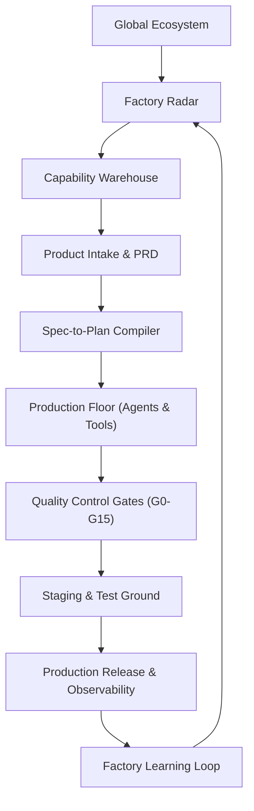
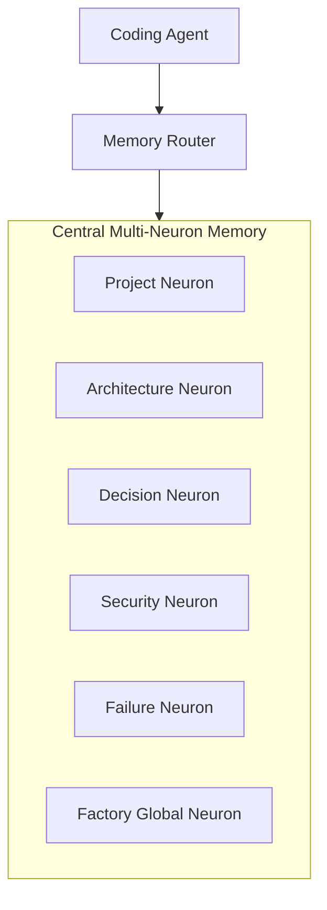

# 🎨 Software Factory Architecture Visualizations

## 1. System Manufacturing Flow

```mermaid
flowchart TD
    Ecosystem["Global Ecosystem"] --> Radar["Factory Radar"]
    Radar --> Warehouse["Capability Warehouse"]
    Warehouse --> ProductIntake["Product Intake & PRD"]
    ProductIntake --> Compiler["Spec-to-Plan Compiler"]
    Compiler --> Floor["Production Floor (Agents & Tools)"]
    Floor --> Gates["Quality Control Gates (G0-G15)"]
    Gates --> Staging["Staging & Test Ground"]
    Staging --> Prod["Production Release & Observability"]
    Prod --> Learn["Factory Learning Loop"]
    Learn --> Radar
```

## 2. Multi-Neuron Central Memory

```mermaid
flowchart TD
    subgraph CentralMemory["Central Multi-Neuron Memory"]
        ProjectNeuron["Project Neuron"]
        ArchNeuron["Architecture Neuron"]
        DecNeuron["Decision Neuron"]
        SecNeuron["Security Neuron"]
        FailNeuron["Failure Neuron"]
        FactNeuron["Factory Global Neuron"]
    end
    Router["Memory Router"] --> CentralMemory
    Agent["Coding Agent"] --> Router
```
