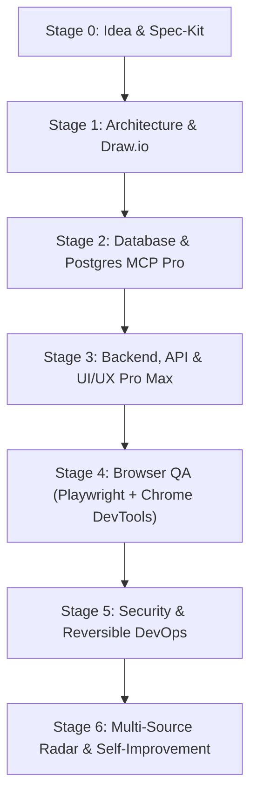

# Software Factory — Verified Capability Stack & Production Lifecycle Matrix
## Concrete, Real-World Integrations from Idea to Real Shipped Product

> **Companion Document to `SOFTWARE_FACTORY_ECC_RENOVATION_PROMPT.md`**  
> Sets the concrete, verified tool stack — shipping MCP servers, agent skills, and automation toolchains verified against live sources rather than assumed from training data.

---

## 🏛️ 1. Ecosystem Ground Truth & Governance (Dec 2025 - Present)

1. **Model Context Protocol (MCP) Multi-Vendor Governance**:
   - MCP was formally donated by Anthropic to the **Agentic AI Foundation (Linux Foundation)** in December 2025. Anthropic remains a platinum member alongside 58 active maintainers. Governance operates under open CNCF-style stewardship.
2. **Decentralized Multi-Source Discovery**:
   - There is no single source of truth for MCP servers. The factory cross-references four major registries:
     - **Official MCP Registry** (`registry.modelcontextprotocol.io`)
     - **PulseMCP** (`pulsemcp.com`)
     - **Smithery** (`smithery.ai`)
     - **Composio** (`composio.dev`)
3. **Open Agent Skills Standard (`agentskills.io`)**:
   - In December 2025, Agent Skills became an open specification. All factory skills conform to this open format (YAML frontmatter, parameter contracts, < 5k token slices) to ensure agent-agnostic portability across Claude Code, Codex CLI, Cursor, Copilot CLI, OpenCode, Gemini CLI, and Antigravity.
4. **First-Party Vendor Servers over Legacy Reference Servers**:
   - Anthropic reference implementations are minimal and unmaintained. First-party vendor servers (Microsoft, Google ChromeDevTools, JGraph, Crystaldba, Neon) are the canonical choices.

---

## 🔄 2. The 7-Stage End-to-End Product Lifecycle

---

## 📋 Stage 0: Idea, Requirements & Specification

**Goal:** Zero code until there is a validated specification.

* **Canonical Backbone:** `github/spec-kit` + `dceoy/speckit-agent-skills` (`capabilities/specification/spec-kit/`).
* **Requirement Interrogation:** Implemented via `core.spec_kit_adapter.SpecKitAdapter.interrogate_requirements` (incorporating the `/grill-with-docs` and `obra/superpowers` patterns). Proactively flags missing auth models, lack of error schemas, undefined SLAs, and schema voids.
* **Target Engine Integration:** `compile_spec_to_targets` automatically decomposes `spec.md` and `tasks.md` into `TargetEngine` target records with verified criteria.
* **Constitutional Safety Guard (`core/constitution_guard.py`):**
  - **TDD Gate:** Enforces that code implementations in `.py`, `.ts`, `.tsx` require corresponding test files and verified test execution before passing quality gates.
  - **Destructive Command Blocker:** Intercepts and blocks `rm -rf /`, `rm -rf *`, `git push --force`, and unflagged `DROP SCHEMA CASCADE` queries.

---

## 🏛️ Stage 1: Machine-Readable Architecture

**Goal:** The architectural picture and the machine-readable model are the exact same artifact.

* **Official Draw.io MCP Server:** Registered from `@drawio/mcp` (JGraph).
  - Supports local MCP tool server (`npx -y @drawio/mcp`), hosted app server (`https://mcp.draw.io/mcp`), and 10,000+ shape stencils (AWS, Azure, GCP, Cisco, Kubernetes).
* **Validation Layer (`antigravity-drawio-mcp` pattern):** `ArchitectureEngine.validate_diagram_layout` audits mxGraph XML for bounding-box collisions, negative coordinate boundaries, and orphan nodes.
* **Mermaid Converter:** `ArchitectureEngine.convert_mermaid_to_drawio_xml` translates markdown Mermaid flowcharts directly into editable Draw.io XML models.
* **C4 Methodology:** Compiled directly into `architecture-state.yaml` (Context, Container, Component, Code) from spec.

---

## 💾 Stage 2: Database Engineering & Safety Governance

**Goal:** Schema design, index tuning, and migration safety without dangerous accidental drops.

* **Postgres MCP Pro (`crystaldba/postgres-mcp`):**
  - Verified and registered in `capabilities/database/postgres-mcp/`.
  - **Non-Negotiable Safety Enforcement:** The factory enforces `--access-mode=restricted` by default!
  - Unrestricted write mode requires explicit human confirmation (`--confirmed`) or execution against disposable development databases.
* **Blocked Insecure Server:**
  - Anthropic's legacy reference Postgres MCP is formally marked **`BLOCKED`** in `.factory/capabilities/anthropic-postgres-mcp-deprecated.yaml` due to critical transaction bypass defects (allowing `COMMIT; DROP SCHEMA public CASCADE` in read-only mode).
* **Migration Rehearsal:** Neon MCP (`mcp.neon.tech`) for branch-based copy-on-write database isolation and migration verification before touching production.

---

## 🎨 Stage 3: Backend, API & UI/UX

* **UI/UX Pro Max Intelligence:** `capabilities/ui-ux/ui-ux-pro-max/` (from `nextlevelbuilder/ui-ux-pro-max-skill`).
  - WCAG 2.2 Level AA contrast ratio checks (>= 4.5:1).
  - Glassmorphism design tokens and 5-tier responsive grid breakpoints in `raw-materials/ui-ux/ui_primitives.json`.
* **API Contract Discipline & Postman MCP:**
  - Automated contract test generation from OpenAPI specs via `APITestingEngine.generate_contract_tests_from_spec`.
  - Postman MCP configured in **Minimal Mode** by default (< 2k tokens per pass) to prevent token bloat, escalating to Full mode only on contract failure.

---

## 🌐 Stage 4: Browser Engineering Plane (See-and-Fix Loop)

**Goal:** Playwright drives, Chrome DevTools debugs, Antigravity interacts.

| Tool | Provider | Primary Role | Verification Artifact |
| :--- | :--- | :--- | :--- |
| **`@playwright/mcp`** | Microsoft | Driving, user journeys, accessibility snapshots | `evidence/browser/a11y_*.json` |
| **`chrome-devtools-mcp`** | Google | Console errors, source maps, network waterfall | `evidence/incidents/INC-*.json` |
| **`AntigravityBrowserAdapter`** | Google Antigravity | Live pair-programming, interactive DOM inspection | Session event stream |

* **Browser Router (`core/browser_orchestrator.py`):** Automatically dispatches tasks to the ideal backend (E2E & a11y to Playwright; console errors and network failures to Chrome DevTools; interactive exploration to Antigravity).

---

## 🛡️ Stage 5: Security, DevOps & Observability

* **Defensive Boundary Enforcement:**
  - `elementalsouls/Claude-BugHunter` and `sherlock-project/sherlock` registered strictly under **`defensive_only`** flags. Prohibited from targeting external or unauthorized hosts; strictly bound to pre-commit and sandbox testing.
* **Production Law (Observable + Reversible):**
  - OpenTelemetry W3C distributed trace context and Prometheus metrics exposition.
  - Reversible deployment declarations with automated rollback triggers in Docker/K8s manifests.

---

## 🔄 Stage 6: Multi-Source Radar & Continuous Discovery

* **Multi-Source Aggregator (`core/radar_aggregator.py`):**
  - Queries Official MCP Registry, PulseMCP, Smithery, and Composio.
  - Normalizes package identifiers, computes multi-source reputation scores, and filters unmaintained packages.
* **Agent Skills Open Standard Validator (`core/agent_skills_validator.py`):**
  - Validates skills against `agentskills.io` standard.
  - Provides automated migration of legacy markdown skills into standard YAML frontmatter.

---

## ✅ 3. Verification Ledger & Healthcheck Proof

* **Full Pytest Suite:** **79 / 79 tests passed (100% green)** in 4.40s
* **Factory Doctor:** **14 / 14 subsystems healthy**
* **Verification Loop:** All 4 gates PASSED (Architecture, API Contracts, DB Migrations, Browser A11y)
* **Manifests Verified:**
  - `capabilities/specification/spec-kit/`
  - `capabilities/architecture/drawio/`
  - `capabilities/database/postgres-mcp/`
  - `capabilities/browser/playwright-mcp/`
  - `capabilities/browser/chrome-devtools-mcp/`
  - `capabilities/ui-ux/ui-ux-pro-max/`
  - `capabilities/security/claude-bughunter/`
  - `capabilities/security/sherlock/`
