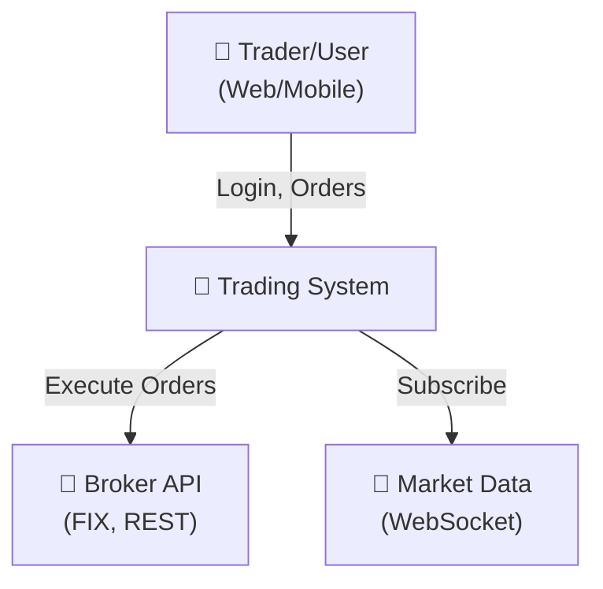
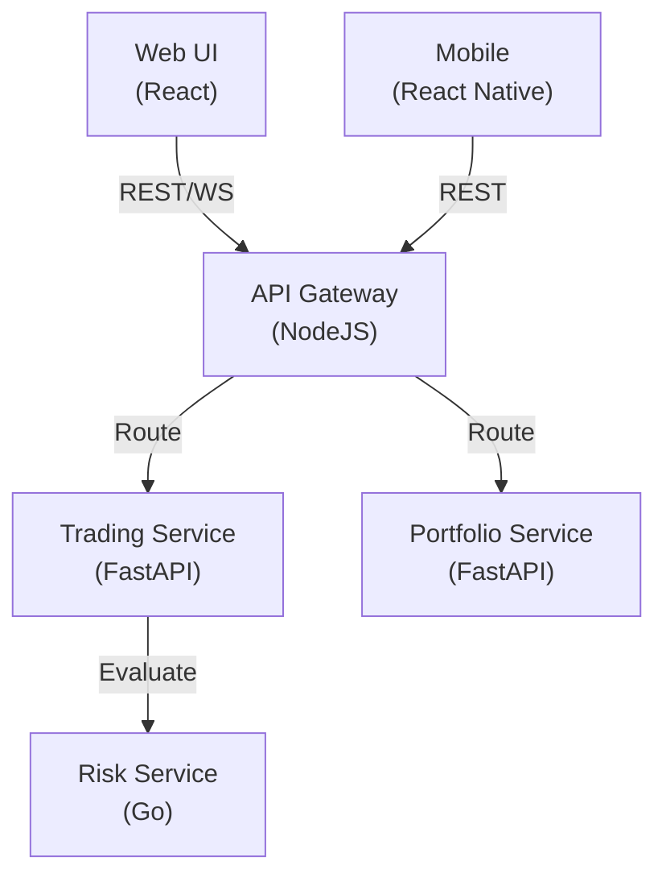
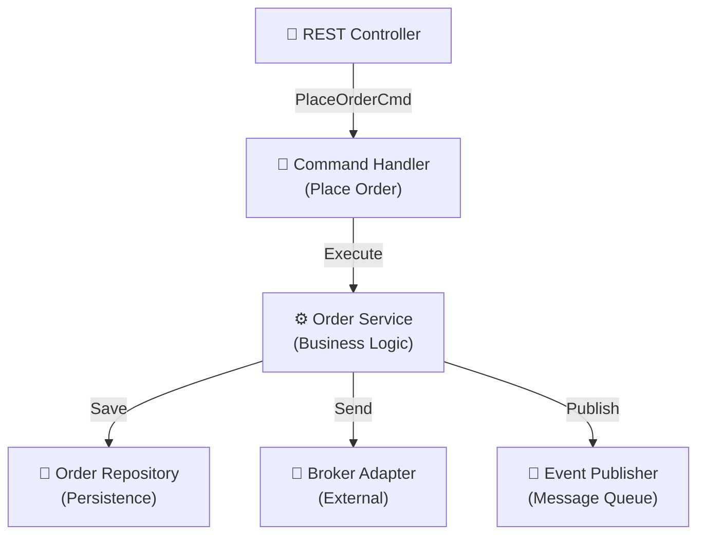
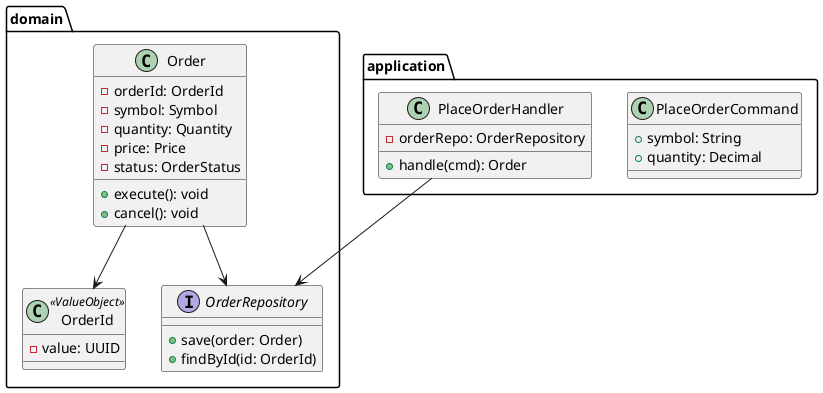
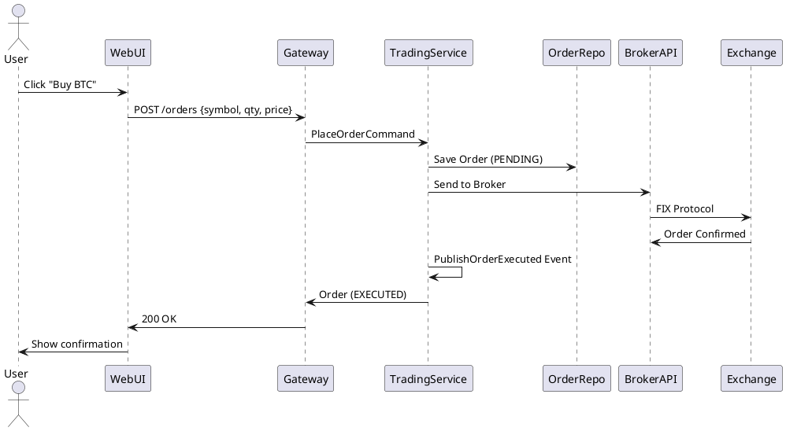

# Architecture Discovery Skill

**Level:** Principal / Enterprise Architect  
**Domain:** System Design, Reverse Engineering, Living Documentation  
**Integrates:** All AI agents (Claude, Copilot, Gemini, Cursor, Windsurf, etc.)

---

## Mission

Enable any AI agent to scan a repository and generate complete architectural documentation:
- Repository structure mapping
- Architecture pattern detection (Microservices, DDD, CQRS, Clean Architecture, etc.)
- C4 Model diagrams (Context → Container → Component → Code)
- UML class diagrams
- Dependency analysis & violation detection
- Data flow sequences
- Deployment architecture
- Security & performance reviews
- Architecture Decision Records (ADRs)
- Living documentation (auto-updated on code changes)

---

## Skill Activation

### For Claude / Claude Code
```bash
claude /architect-discovery --scan repo
claude /architect-discovery --generate-c4
claude /architect-discovery --watch repo
```

### For Copilot (VSCode)
```
#copilot /architecture-discovery
```

### For Cursor
```bash
cursor /architect-discovery --agent discovery
```

### For Gemini / Notebooks
```python
from software_factory import ArchitectureDiscovery
arch = ArchitectureDiscovery(repo_path)
arch.scan()
arch.generate_reports()
```

---

## Core Workflows

### 1. Quick Architecture Scan (15 min)

**Use When:** You need immediate understanding of a new codebase

**Steps:**
1. Scan directory structure
2. Identify services/components
3. Detect primary architecture style
4. Generate annotated tree

**Command:**
```bash
./software-factory/scripts/quick-discover.sh /path/to/repo
```

**Output:**
- `REPOSITORY_MAP.md` - Annotated tree
- `ARCHITECTURE_ANALYSIS.md` - Pattern detection

---

### 2. Full Architecture Discovery (1-2 hours)

**Use When:** Building complete architectural understanding

**Steps:**
1. **PHASE 1:** Repository scan & tree
2. **PHASE 2:** Pattern detection
3. **PHASE 3:** DDD analysis
4. **PHASE 4:** C4 generation (all levels)
5. **PHASE 5:** Dependency analysis
6. **PHASE 6:** Data flow sequences
7. **PHASE 7:** Infrastructure mapping
8. **PHASE 8:** Test coverage analysis
9. **PHASE 9:** Security review
10. **PHASE 10:** Performance hotspots
11. **PHASE 11:** ADR generation
12. **PHASE 12:** Documentation creation
13. **PHASE 13:** Setup living mode

**Command:**
```bash
./software-factory/scripts/full-discover.sh /path/to/repo
```

**Output:**
- Complete `docs/architecture/` directory
- All C4 and UML diagrams
- Security & performance reports
- ADRs and decision documentation

---

### 3. Continuous Living Architecture (Ongoing)

**Use When:** You want architecture docs to stay in sync with code

**Setup:**
```bash
./software-factory/scripts/watch-architecture.sh /path/to/repo
```

**Triggers:**
- On every commit: Detect changes
- Update only affected diagrams
- Flag violations immediately
- Auto-update documentation

---

## Phase Details & Outputs

### Phase 1: Repository Structure

**Output:** `docs/architecture/REPOSITORY_MAP.md`

```markdown
# Repository Structure

project-root/                       # Enterprise SaaS Platform
├── .github/
│   ├── workflows/
│   │   ├── ci.yml                 # Build pipeline: compile, lint, test
│   │   └── cd.yml                 # Deploy: stage → prod
│   └── CODEOWNERS                 # Code review ownership
├── docs/
│   ├── architecture/              # **AUTO-GENERATED**
│   ├── diagrams/
│   └── guides/
├── src/
│   ├── api-gateway/               # C4 Container: API Gateway (NodeJS)
│   │   ├── src/
│   │   │   ├── middleware/        # Auth, logging, CORS
│   │   │   ├── routes/            # Route definitions
│   │   │   └── utils/
│   │   └── Dockerfile
│   ├── trading-service/           # C4 Container: Trading Service (Python/FastAPI)
│   │   ├── src/
│   │   │   ├── domain/            # DDD: Business logic
│   │   │   ├── application/       # DDD: Use cases
│   │   │   ├── infrastructure/    # DDD: Adapters
│   │   │   └── presentation/      # DDD: Controllers
│   │   └── Dockerfile
│   ├── portfolio-service/         # C4 Container: Portfolio Service
│   └── shared/                    # Shared libraries, protocols
├── tests/
│   ├── unit/
│   ├── integration/
│   └── e2e/
├── deployments/
│   ├── docker/
│   ├── kubernetes/
│   └── terraform/
└── README.md
```

---

### Phase 2: Architecture Pattern Detection

**Output:** `docs/architecture/ARCHITECTURE_ANALYSIS.md`

Detects:
- **Monolith** / **Modular Monolith** / **Microservices**
- **DDD** (Bounded Contexts)
- **Hexagonal** / **Onion** / **Clean** / **Layered**
- **CQRS** / **Event Sourcing**
- **Event-Driven** / **Serverless**

**Result:**
```markdown
# Architecture Analysis

| Pattern | Confidence | Evidence |
|---------|-----------|----------|
| Microservices | 95% | 5+ services, separate DBs, async messaging |
| DDD | 92% | domain/, application/, infrastructure/, aggregates |
| Event-Driven | 88% | EventBus, event handlers, message queue |
| CQRS | 75% | Separate read/write paths in code |
| Hexagonal | 65% | Clear input/output ports |

## Primary Architecture: Microservices + DDD + Event-Driven
```

---

### Phase 3: DDD Model Mapping

**Output:** `docs/architecture/DDD_MODEL.md`

Identifies:
- **Bounded Contexts** (independent domains)
- **Aggregates** (root entities)
- **Value Objects** (immutable data)
- **Repositories** (data access)
- **Domain Services** (business logic)
- **Events** (domain events)

**Example:**
```markdown
## Context: Trading Engine

**Purpose:** Execute orders, settle trades, track positions

### Aggregates
- Order (root aggregate)
  - Entities: OrderLine, ExecutionHistory
  - Value Objects: OrderId, Price, Quantity
  - Repositories: OrderRepository
  - Events: OrderCreated, OrderExecuted, OrderCancelled

### Domain Services
- OrderExecutionService: Matches orders, executes trades
- PositionCalculator: Computes portfolio positions
- RiskEvaluator: Checks order risk

### External Integrations
- Broker API (via BrokerAdapter)
- Market Data (via WebSocket feed)
```

---

### Phase 4: C4 Model Generation

#### Level 1: System Context


#### Level 2: Containers


#### Level 3: Components (Within Trading Service)


#### Level 4: UML Code Model


---

### Phase 5: Dependency Analysis

**Output:** `docs/architecture/DEPENDENCY_ANALYSIS.md`

Detects:
- ✓ Valid dependencies
- ✗ Cyclic dependencies
- ✗ Layer violations
- ✗ Unwanted coupling

**Report:**
```markdown
# Dependency Analysis

## Layer Validation

| From | To | Status | Notes |
|------|----|----|-----------|
| presentation → application | ✓ | Controllers use services |
| application → domain | ✓ | Services use entities |
| domain → infrastructure | ✗ | VIOLATION: Domain should be dependency-free |
| infrastructure → presentation | ✗ | VIOLATION: Adapters not injected |

## Cyclic Dependencies
- ❌ OrderService ↔ PaymentService (3 files)
- ❌ RiskService ↔ OrderService (2 files)

## High Coupling
- TradingService too tightly coupled to PostgreSQL (8 references)
- Recommendation: Use repository pattern
```

---

### Phase 6: Data Flow & Sequences

**Output:** `docs/architecture/DATA_FLOW.md`

Example: "Place Trade Order" sequence



---

### Phase 7: Infrastructure & Deployment

**Output:** `docs/architecture/DEPLOYMENT.md`

```markdown
# Deployment Architecture

## Kubernetes Cluster

### Namespaces
- `trading-prod`: Production services
- `trading-stage`: Staging
- `trading-dev`: Development

### Services

| Service | Image | Replicas | CPU | Memory | Purpose |
|---------|-------|----------|-----|--------|---------|
| api-gateway | api-gateway:v1.2.3 | 3 | 500m | 512Mi | Route requests |
| trading-service | trading-svc:v2.1.0 | 2 | 1000m | 1Gi | Order execution |
| portfolio-service | portfolio-svc:v1.5.0 | 2 | 500m | 512Mi | Position tracking |

## Data Persistence

| Database | Type | RTO | RPO | Backups |
|----------|------|-----|-----|---------|
| PostgreSQL | Primary DB | 1h | 5min | Hourly → S3 |
| Redis | Cache/Streams | 15min | 0min | None (ephemeral) |

## External Integrations

- **Broker:** FIX protocol, connection pooling, retry logic
- **Market Data:** WebSocket, auto-reconnect
- **Message Queue:** RabbitMQ, persistent topics
```

---

### Phase 8: Test Coverage

**Output:** `docs/architecture/TEST_COVERAGE.md`

```markdown
# Test Coverage by Layer

| Layer | Type | Coverage | Status | Gaps |
|-------|------|----------|--------|------|
| Domain | Unit | 96% | ✓ Excellent | None |
| Application | Integration | 72% | ⚠ Needs work | Message handling, edge cases |
| Infrastructure | Component | 45% | ✗ Low | Broker integration, DB failover |
| Presentation | E2E | 58% | ⚠ Medium | WebSocket tests, load scenarios |

## Priority Improvements
1. Add broker connectivity E2E tests
2. Increase infrastructure component tests
3. Add load testing for WebSocket
```

---

### Phase 9: Security Architecture

**Output:** `docs/architecture/SECURITY.md`

```markdown
# Security Architecture

## Authentication

| Component | Method | Status |
|-----------|--------|--------|
| Web UI | OAuth2 + JWT | ✓ Implemented |
| Mobile | JWT + Refresh Token | ✓ Implemented |
| Service-to-Service | mTLS | ⚠ In Progress |
| API Key | HMAC-SHA256 | ✓ Implemented |

## Data Protection

| Data | Location | Encryption | Access Control |
|------|----------|------------|-----------------|
| Passwords | Auth DB | Bcrypt, salt | Hashed only |
| API Keys | Vault | AES-256 | Role-based |
| Trades | PostgreSQL | At-rest | Row-level RLS |
| Audit Logs | S3 | Encrypted | Immutable |

## Findings
- ✓ HTTPS enforced
- ✓ Input validation comprehensive
- ✗ Rate limiting missing on API
- ✗ WebSocket lacks TLS
```

---

### Phase 10: Performance Hotspots

**Output:** `docs/architecture/PERFORMANCE.md`

```markdown
# Performance Analysis

## Bottlenecks

| Component | Issue | Impact | Severity |
|-----------|-------|--------|----------|
| OrderService.execute() | Sync I/O to broker | P0 Blocking (5s) | CRITICAL |
| PortfolioCalculator | N+1 position queries | P1 Slow (2s) | HIGH |
| WebSocket broadcast | Single-threaded | P2 Latency (100ms+) | MEDIUM |

## Recommendations
1. **OrderService:** Convert to async/await, add circuit breaker
2. **Portfolio:** Batch queries, add caching
3. **WebSocket:** Multi-consumer architecture, Redis Pub/Sub
```

---

### Phase 11: Architecture Decision Records

**Output:** `docs/architecture/adr/`

Example ADR:
```markdown
# ADR-001: Microservices Architecture

**Date:** 2026-05-15  
**Status:** Accepted  
**Decision Maker:** Architecture Team

## Context
System reached 500K daily trades. Monolith deployment pipeline took 45 minutes. Team > 20 engineers, multiple feature teams.

## Decision
Split monolith into independent microservices:
- Trading Service (order execution)
- Portfolio Service (position tracking)
- Risk Service (compliance checking)

## Consequences

### Positive
- ✓ Independent scaling per service
- ✓ Faster deployment (10 min per service)
- ✓ Clear ownership per team
- ✓ Technology flexibility

### Negative
- ✗ Distributed transaction complexity
- ✗ Increased operational overhead
- ✗ Network latency (service-to-service)

## Alternatives Considered
1. **Modular Monolith** → Rejected: coupling issues remained
2. **Serverless** → Rejected: cold start too slow for trading
3. **Event Sourcing Everywhere** → Rejected: complexity not justified yet
```

---

### Phase 12: Complete Documentation

**Auto-generated in `docs/architecture/`:**

```
docs/architecture/
├── REPOSITORY_MAP.md              # Tree + annotations
├── ARCHITECTURE_ANALYSIS.md       # Pattern detection
├── DDD_MODEL.md                   # Bounded contexts, aggregates
├── C4_CONTEXT.md                  # Level 1 (system context)
├── C4_CONTAINER.md                # Level 2 (services)
├── C4_COMPONENT.md                # Level 3 (internal)
├── C4_CODE.md                      # Level 4 (UML classes)
├── DEPENDENCY_ANALYSIS.md         # Coupling, cycles, violations
├── DATA_FLOW.md                   # Sequence diagrams
├── DEPLOYMENT.md                  # Infrastructure, K8s, cloud
├── TEST_COVERAGE.md               # Coverage by layer
├── SECURITY.md                    # Auth, encryption, RBAC
├── PERFORMANCE.md                 # Hotspots, optimization
├── VIOLATIONS.md                  # Architecture breaches
├── adr/
│   ├── ADR-001-microservices.md
│   ├── ADR-002-event-sourcing.md
│   └── ADR-003-kubernetes-migration.md
└── diagrams/
    ├── c4-context.puml / .mmd
    ├── c4-container.puml / .mmd
    ├── c4-component.puml / .mmd
    ├── uml-order.puml / .mmd
    ├── sequence-place-trade.puml / .mmd
    ├── deployment.puml / .mmd
    └── dependency-graph.mmd
```

---

### Phase 13: Living Architecture Mode

**Continuous Updates:**

```bash
# Watch for changes, auto-update docs
./software-factory/scripts/watch-architecture.sh /path/to/repo
```

**On Every Commit:**
1. Detect file changes
2. Identify affected components
3. Re-scan only changed areas
4. Update affected diagrams
5. Check for violations
6. Flag breaking changes in CI/CD

---

## Checklists

### Pre-Discovery
- [ ] Repository cloned locally
- [ ] All dependencies installed
- [ ] Code compiles / lints successfully
- [ ] Git history available

### Post-Discovery
- [ ] All 13 phases completed
- [ ] Documentation reviewed for accuracy
- [ ] Diagrams generated (PlantUML + Mermaid)
- [ ] ADRs recorded
- [ ] Team notified of architecture map
- [ ] Living mode configured

### Violation Resolution
- [ ] Cyclic dependencies fixed
- [ ] Layer violations corrected
- [ ] Tight coupling refactored
- [ ] Tests updated
- [ ] Documentation refreshed

---

## Anti-Patterns to Avoid

### ❌ Over-Complexity
- Generating 100+ diagrams nobody reads
- ADRs for every tiny decision
- Documentation that diverges from code

**✓ Instead:** Focus on highest-impact diagrams, keep docs in sync

### ❌ Stale Architecture
- Discovery runs once, never updated
- Code evolves, docs stay old
- Violations introduced without notice

**✓ Instead:** Use living mode, auto-detect changes

### ❌ Wrong Abstraction Level
- Showing every class in one diagram
- Missing the bounded context forest for domain trees

**✓ Instead:** C4 levels separate concerns (context → code)

---

## Success Criteria

✓ Repository structure fully understood  
✓ Architecture patterns clearly identified  
✓ C4 model generated (all 4 levels)  
✓ DDD model mapped (contexts, aggregates)  
✓ Data flows documented  
✓ Violations detected & tracked  
✓ ADRs recorded  
✓ All docs committed to git  
✓ Living mode operational  

**Result:** New team members onboard in 1 hour instead of 1 week.

